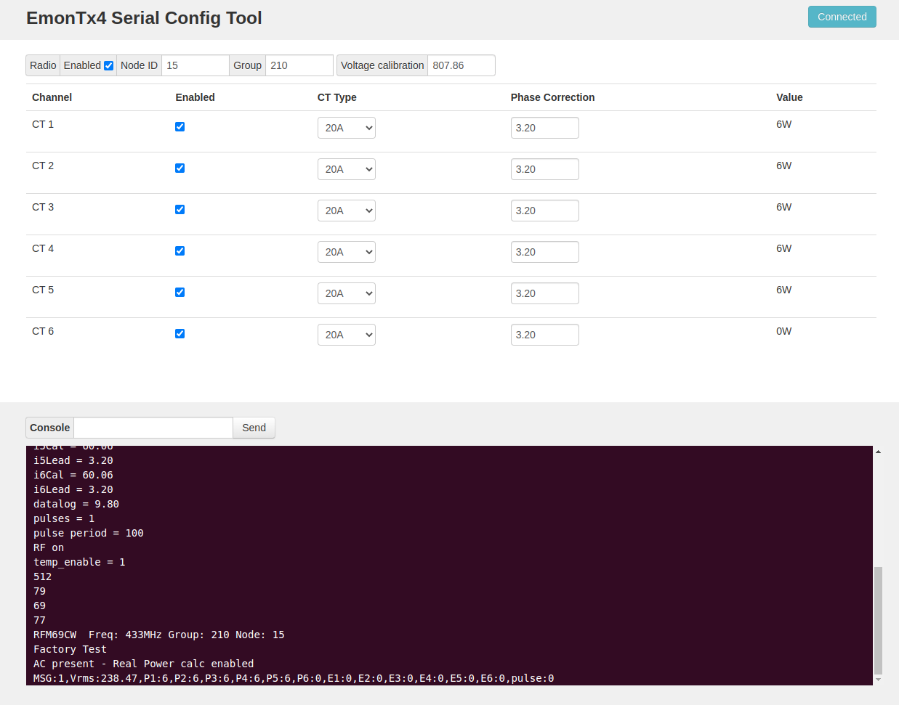

# Configuration

The emonTx4 comes configured as standard with the following default configuration:

```
- OpenEnergyMonitor precision voltage sensor (Vcal: 807.86)
- CT 1: 100A 0.333V (Ical: 300.3, Ilead: 3.2)
- CT 2: 50A 0.333V (Ical: 150.15, Ilead: 3.2)
- CT 3: 50A 0.333V (Ical: 150.15, Ilead: 3.2)
- CT 4: 20A 0.333V (Ical: 60.06, Ilead: 3.2)
- CT 5: 20A 0.333V (Ical: 60.06, Ilead: 3.2)
- CT 6: 20A 0.333V (Ical: 60.06, Ilead: 3.2)
- Transmit via RFM69CW: ON
- Radio nodeid: 15
- Radio group: 210
- Radio frequency: 433 MHz
- Datalogging period: 9.8s 
- Minimum pulse period: 100ms
```

To use the emonTx4 with a different CT arrangement, or radio node and group these settings can be adjusted over serial, using either an online web tool or directly via a serial console.

## 1) Using the web tool

**Note: Uploading via USB-C will only work if connected in the right orientation. Try turning the USB-C connector around if upload fails.** 

With the emonTx connected via a USB-C cable to a computer, it's possible to configure the emonTx directly from a WebSerial compatible internet browser. 

Compatible browsers: [Chrome, Edge, Opera](https://developer.mozilla.org/en-US/docs/Web/API/Web_Serial_API#browser_compatibility)

Launch the tool: [openenergymonitor.org/serial](https://openenergymonitor.org/serial/)



## 2) Directly via serial

Alternatively it's possible to configure the emonTx4 directly via serial using the arduino serial monitor or other similar tool. 
The following details the available commands and their function.

Available commands:

- **l** list the settings
- **r** restore sketch defaults
- **s** save settings to EEPROM
- **v** show firmware version
- **z** zero energy values
- **x** exit, lock and continue
- **?** show this text again
- **w\<x\>** turn RFM Wireless data off: x = 0 or on: x = 1
- **b\<n\>** set r.f. band n = a single numeral: 4 = 433MHz, 8 = 868MHz, 9 = 915MHz (may require hardware change)
- **p\<nn\>** set the r.f. power. nn - an integer 0 - 31 representing -18 dBm to +13 dBm. Default: 25 (+7 dBm)
- **g\<nnn\>** set Network Group nnn - an integer (OEM default = 210)
- **n\<nn\>** set node ID n= an integer (standard node ids are 1..60)
- **d\<xx.x\>** a floating point number for the datalogging period
- **c\<n\>** n = 0 for OFF, n = 1 for ON, enable current & power factor values to serial output for calibration.
- **f\<xx\>** the line frequency in Hz: normally either 50 or 60
- **k\<x\> \<yy.y\> \<zz.z\>**
  - Calibrate an analogue input channel:
  - x = a single numeral: 0 = voltage calibration, 1 = ct1 calibration, 2 = ct2 calibration, etc
  - yy.y = a floating point number for the voltage/current calibration constant
  - zz.z = a floating point number for the phase calibration for this c.t. (z is not needed, or ignored if supplied, when x = 0)
  - e.g. k0 256.8
  - k1 90.9 2.00
- **a\<xx.x\>** a floating point number for the assumed voltage if no a.c. is detected
- **m\<x\> \<yy\>** meter pulse counting: 
  - x = 0 for OFF, x = 1 for ON
  - yy = an integer for the pulse minimum period in ms. (y is not needed, or ignored when x = 0)
- **t0 \<y\>** turn temperature measurement on or off: y = 0 for OFF, y = 1 for ON
- **t\<x\> \<yy\> \<yy\> \<yy\> \<yy\> \<yy\> \<yy\> \<yy\> \<yy\>**
  - change a temperature sensor's address or position:
  - x = a single numeral: the position of the sensor in the list (1-based)
  - yy = 8 hexadecimal bytes representing the sensor's address
  - e.g. 28 81 43 31 07 00 00 D9
  - N.B. Sensors CANNOT be added.

