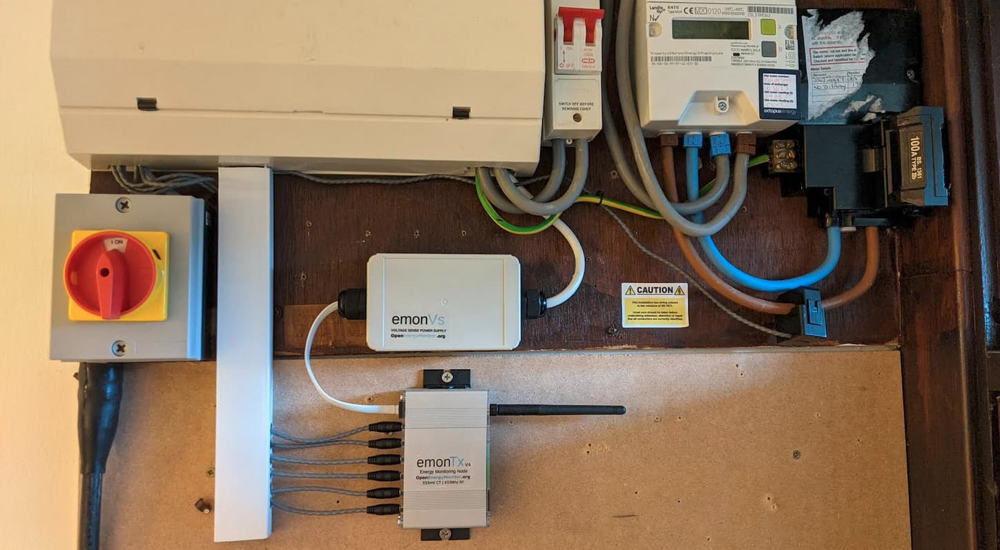
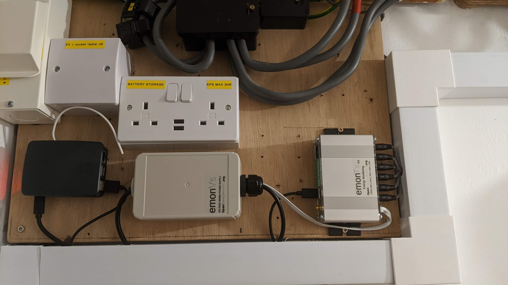
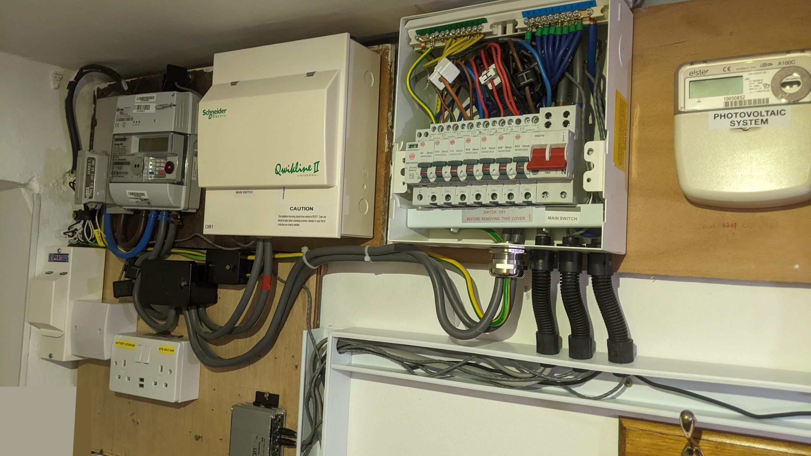

# emonTx4, emonVs & emonBase Install Guide

The following guide covers installation of the [emonTx4 6x input energy monitor](overview.md) in combination with an [emonBase (RaspberryPi base-station)](../emonbase/rfm69-spi.md). Using an emonTx4 with an emonBase provides full local emoncms data logging and visualisation capabilities as well as the option to expand data input from other devices.


**Hardware covered in this guide:**

- [emonTx4: 6 input energy monitor](overview.md)
- [emonVs: Precision voltage sensor and power supply](voltage_sensors.md)
- [emonBase: RaspberryPi base-station](../emonbase/rfm69-spi.md)
- Up to 6 CT sensors
- RJ11 voltage sensor cable

**If you already have an emonPi or emonBase** you can use this rather than needing to buy a new emonBase. The terms emonPi/emonBase can be used interchangeably in this guide. Please see the [Adding to an existing install guide](emontx4_emonpi_install.md).

## Quick Start

1. Clip the CT current sensors around Live OR Neutral cable of the AC circuit to be measured (not both)

2. Plug the CT current sensors into emonTx4 via 3.5mm jack plugs

3. Plug emonVS RJ11 cable into emonTx4

4. Plug emonVS USB-C cable into emonBase Raspberry Pi base-station power input connector

5. Plug emonVS into mains power via a domestic wall socket

6. (optionally) connect emonBase Raspberry Pi base-station to Ethernet

7. Switch on mains socket and verify that the red LED on the emonTx4 and the red LED on the Raspberry Pi illuminates.

8. Continue with step 5. emonBase Setup below.

```{admonition} Instructions for safe use
- Clip-on CT sensors are non-invasive and should not have direct contact with the AC mains. As a precaution, we recommend ensuring all cables are fully isolated prior to installing. If in doubt seek professional assistance.
- Do not expose to water or moisture
- Do not expose to temperate above rated operating limits
- Indoor use only
- Do not connect unapproved accessories
- Please contact us if you have any questions
```

## Extended version

A good place to start is to assess the location where you wish to install the emonTx4, identify the circuits that you wish to monitor using the clip-on CT sensors and decide how you would like to install the emonVs voltage sensor. There are a couple of example installations given below which may provide inspiration.

## 1. emonVs installation

There are two different ways of installing the emonVs voltage sensor:

**Using the mains plug supplied:** If you have a convenient socket near-by this is be the easiest and quickest option.<br>

**Direct installation:** The emonVs can be hardwired by a suitably competent person into a 6A or lower circuit protection device in the fuse board (consumer unit) or a 3A fused spur. The supplied emonVs mains power cable has a cross sectional area of 1.5mm<sup>2</sup>. This can provide a tidy installation if no socket is available and helps ensure higher monitoring uptime if sockets are at risk of being unplugged for use by other appliances.

The emonVs unit can be wall mounted using the brackets on the enclosure. Start by marking the position of the holes and then, with the emonVs removed, screw in the screw for the bracket below the larger gland first. Slide the emonVs into place before inserting the second screw near the low profile gland used for the power cable.

## 2. CT sensor installation

- Current transformers (CTs) are sensors that measure alternating current (AC).

- The emonTx4 supports a wide variety of 333mV voltage output CT sensors. We stock 20A, 50A, 100A & 200A options in the OpenEnergyMonitor shop. The physical size of these CT sensors is also roughly proportional to their current rating. For highest accuracy it's a good idea to choose CT sensors that match the rating of the circuit being monitored. As an example a 20A CT should be used for 16A or 20A circuits, a 50A CT for 32A EV chargers or 100A CT for whole house monitoring (assuming a 100A rated supply).

- CT sensors need to be clipped around the Live OR Neutral cable of the AC circuit to be measured (not both).

- Take care not to compress the sensor with any sideways force as this can affect the accuracy of the measurement.

- The new range of CT sensors used with the emonTx4 are all voltage output CT sensors with integrated burden resistors and so are safe to clip on to the circuits that you wish to measure before plugging into the emonTx4 if that makes installation easier.

- Note the CT sensor used on each circuit, as well as the channel number on the emonTx4 that the CT is connected to, as this may be required to calibrate the emonTx4 if you are using non standard CT ratings. It's worth making a physical note of this on a label next to the emonTx4 for future reference.


```{note}
The emonTx4 requires voltage output CT sensors, it is not compatible with the old current output YHDC (blue) 100A CT sensors - unless appropriate burden resistors are installed.
```

```{tip} 
With 6 CT sensor cables and often more cable than you need it's easy for an installation to look like a hive of wires! A little electrical trunking can go a long way to tidying it all up, allowing for excess cable to be looped back on itself.
```

## 3. emonTx4 Installation

- The emonTx4 can be wall mounted using the wall mounting kit supplied. A vertical orientation can help reduce risk of things falling onto the sockets and can make for an easier installation in terms of CT sensor routing. See installation example images below.

- Connect the RJ11 cable (telephone sized connector with 6 pins) from the emonVs voltage sensor to the RJ11 socket which is on the same side as the CT sensor sockets. (The larger RJ45 socket on the other side is for temperature and pulse counting, take care not to plug the RJ11 plug into the RJ45 socket).

- Plug in the CT sensors, note which CT sensor is plugged into each input on the emonTx4 as each input needs to have the correct calibration applied.

- This is a good point to calibrate the emonTx4 with the correct configuration to match the CT sensors connected. There are a couple of different ways of doing this, the easiest is to use our browser based web-serial configuration tool supported by Chrome, Edge and Opera browsers.

```{note}
Unless otherwise selected in the shop, the emonTx4 is pre-calibrated with the following default CT ratings:

- Channel 1: 100A
- Channel 2: 50A
- Channel 3: 50A
- Channel 4: 20A 
- Channel 5: 20A 
- Channel 6: 20A

```

**Browser based configuration tool**
- Connect the emonTx4 to your computer using a USB-C cable,
- Open the web-serial configuration tool [https://openenergymonitor.org/serial](https://openenergymonitor.org/serial) (Browser must be Chrome, Edge or Opera). Firefox and Safari do not currently support the web-serial technology used by this tool.
- Click on 'Connect' and select the emonTx4 serial port in the pop up menu. It should be listed as 'CP2102N USB to UART Bridge Controller..'
- After a couple of seconds the emonTx4 will print out it's current configuration which will populate the interface.
- Adjust the  CT type to match the CT sensor that you have installed on each channel.
- Click on 'Save Changes' to ensure that the new configuration is recorded such that it persists when you power cycle the board.

```{note} 
The USB-C connection on the emonTx4 only works in one orientation for data transfer (usually smooth face up). If the config tool doesn't connect then invert the orientation of the plug.
```

## 4. emonBase Installation

- Depending on the installation it may make sense to install the emonBase next to the emonTx4 or further away, perhaps near the internet router for Ethernet connectivity.
- The emonBase can receive data from the emonTx4 either via 433 MHz radio or if near by via wired USB connection.
- If near by, the emonBase can be powered by the emonVs USB-C cable.
- Alternatively a separate USB-C power supply will be required if located elsewhere.
- Before powering up the emonBase, you may want to enable SSH an pre-configure your WiFi details on the SD card first. See [emonSD: before bootup SSH & WiFi configuration](../emonsd/download.md).

## 5. emonBase setup

- **If the emonBase is powered up without Ethernet connected it will create a Wi-Fi Access Point** called `emonsd`. Connect to this using password `emonsd2022`. Browse the IP address [http://192.168.42.1](http://192.168.42.1) and follow the setup wizard to connect the device to your local Wi-Fi network.
- **Once connected via Wi-Fi or Ethernet** the base-station can be accessed via [http://emonpi](http://emonpi) or [http://emonpi.local](http://emonpi.local). If you are unable to locate the emonBase via this hostname, try using a network scanner app such as ['Fing'](https://play.google.com/store/apps/details?id=com.overlook.android.fing&hl=en_GB&gl=US) or ['Network Analyser'](https://play.google.com/store/apps/details?id=net.techet.netanalyzerlite.an&hl=en_GB&gl=US) to list the IP addresses of devices on your network.
- **The emonBase should now present the emoncms login screen.** Create a local account and login.
- **Configure inputs by navigating to Setup > Inputs.** The emonTx4 will pop up here automatically under the emonTx4_xx node name. If you have connected the emonTx4 to the emonBase directly via USB it will appear twice, first under the emonTx4_xx node name corresponding to data received over radio and second under the 'emonTx4' node name corresponding to data received directly over USB. You may wish to disable the radio link at this point.

```{note} 
The USB-C connection on the emonTx4 only works in one orientation for data transfer (usually smooth face up), if you are not receiving data then invert the orientation of the plug.
```

```{tip} 
**The emonTx4 radio can be disabled if using USB:** on the emonBase local Emoncms webpage navigate to Admin > Serial Config to bring up the emonTx4 serial configuration interface. This version runs locally on the emonBase and is compatible with all browsers. Click on 'Stop EmonHub' and then click on 'Start' for the serial connection above it. In the console entry box type 'w0' and click 'Send'. You should see 'RF off' printed in the console log window below. Next enter the character 's' for save in the console entry box and click 'Send' again. This will save and persist this setting. You can at this point use the serial configuration interface to adjust CT calibration if needed. Once complete click on 'Stop Serial' and then 'Start EmonHub' again. Navigate back to Setup > Inputs, after about 20s the USB inputs should resume.
```
- **The next step is to log the input data to feeds.** Inputs are just placeholders showing the latest values sent from the emonTx4, we need to create feeds if we want to record a time-series of these values. It's possible to either manually configure each input as required or if you just want to record everything for now and delete what you don't need later. it's possible to use the preconfigured Device template.

    **Tip: Input configuration using the emonTx4 device template:** On the Setup > Inputs page, Click on the cog icon (top right corner) of the emonTx4 node. The 'Configure Device' window will appear, click on 'emonTx4 Standard', you may need to scroll down a little in the Devices pane to find. Click 'Save' and 'Initialize'. This will create feeds that record real power and cumulative energy for each channel, Vrms, total message count, temperatures and total pulse count. Navigate to Setup > Feeds to see these feeds.

    **Manual input configuration:** You may only want to record specific channels or apply more complex input processing. See input processing guide.

- **With feeds created, explore the data using the graph view.** Navigate to Setup > Feeds and click on a feed of interest to open the graph view. Click on the drop down time selector near the title and select the last hour. Click and drag to zoom further to see the new data coming in.

- **Try creating an Emoncms App.** Click on the Apps tab. From the Available Apps list select 'My Electric' and click 'Create', Select a power feed for 'use' and cumulative kWh energy feed for 'use_kwh' and then click 'Launch App'. After a few days this will start to show a daily bar graph of consumption alongside the real-time power graph and totals. There are a wide variety of different app's to choose from depending on the application.

## Installation Examples

**Installation example 1**<br>
In this installation example the emonVs has been hardwired into a suitable circuit breaker in the consumer unit. 5 CT sensors are clipped around individual circuits in the consumer unit and 1 CT sensor is clipped around the main supply to the house. The emonBase is located separately in the living room and receives data from the emonTx4 via 433 MHz radio. A short strip of trunking here made all the difference for a neater finish!



**Installation example 2**<br>
In this installation the emonBase is located next to the emonVs and emonTx4. Both the emonTx4 and the emonBase are powered by the emonVs. The CT cables are routed through the trunking to the consumer unit where they are clipped around the individual circuits that are being monitored.




