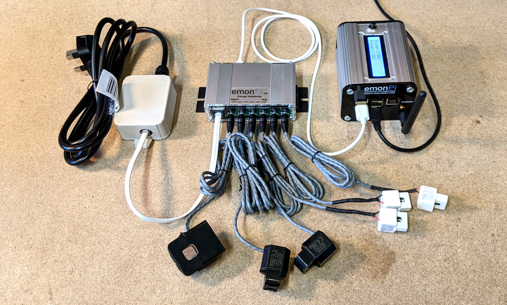
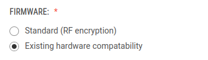
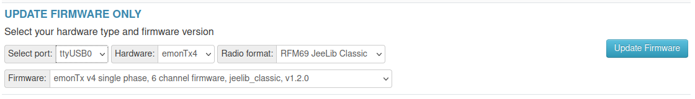

# Adding an emonTx4 to an existing installation



There are two ways to add an emonTx4 to an existing emonPi or emonBase installation:

1. Direct USB data connection
2. 433Mhz radio data connection

---

## Direct USB data connection

The emonTx4 can be connected to an existing emonPi via a USB-C to USB-A cable (as shown in the example picture above), measurement data can be transferred over USB. This provides a simple and reliable setup.

**Tip:** For a lower cost single-phase configuration the emonTx4 can be powered from the emonPi over the same USB connection. The emonTx4 can then use the emonVs-mini pictured above (voltage sensor only - *Available soon*) rather than the full emonVs-psu (voltage sensor with integrated power supply).

**Configuration**<br>The main thing we need to do here is tell a piece of software on the emonPi called emonHub to read from the USB serial port. 

1. Login to your local emonPi Emoncms account and navigate to Setup > EmonHub > Edit Config.

2. Under the `[interfacers]` section add the following interfacer config:

```
[[USB]]
    Type = EmonHubOEMInterfacer
    [[[init_settings]]]
        com_port = /dev/ttyUSB0
        com_baud = 115200
    [[[runtimesettings]]]
        pubchannels = ToEmonCMS,
        nodename = emonTx4
```

With that in place you should now see the emonTx4 inputs appear in your Emoncms inputs list.

**It is advisable to make sure that you are running the latest version of the emonHub software** as it has a couple of improvements to make sure that the USB serial connection recovers automatically after a failure such as unplugging and plugging back in the USB cable.

**If you have multiple USB ports in use** there is a risk that a device on /dev/ttyUSB0 might swap around with another on /dev/ttyUSB1. It's possible to reference the serial port by-id for a more robust solution:

    ls /dev/serial/by-id/*
    
example response:

    /dev/serial/by-id/usb-Silicon_Labs_CP2102N_USB_to_UART_Bridge_Controller_589399f65987ec118b30e33719c2d21c-if00-port0

Modify the emonhub.conf entry with the full path e.g:

    [[[init_settings]]]
        com_port = /dev/serial/by-id/usb-Silicon_Labs_CP2102N_USB_to_UART_Bridge_Controller_589399f65987ec118b30e33719c2d21c-if00-port0

---

## 433Mhz radio data connection

Data can be transferred between the emonTx4 and emonPi via 433Mhz radio. 

**A key thing to watch out for here** is that the default radio packet format for the latest emonTx4 is based on the **LowPowerLabs RFM69** code which is **not compatible** with an emonPi running the original JeeLib 'classic' code.

It is however easy to **change a new emonTx4 to transmit using the original JeeLib classic format** so that compatibility is maintained.

We will soon also offer a new firmware release for existing emonPi and emonBase systems for those keen to upgrade to the new LowPowerLabs RFM69 format which offers hardware encryption and a packet acknowledgment/retry mechanism to minimize packet loss.

### 1. Shop option at time of purchase

It's possible to select the firmware version in the shop when buying an emonTx4:



**Standard:** LowPowerLabs radio format. **Existing hardware compatibility:** JeeLib classic format.


### 2. Using an emonPi to update/change the emonTx4 firmware

The easiest way of updating or changing the emonTx4 firmware is to connect it to an emonPi or emonBase with a USB cable and then use the firmware upload tool available at Setup > Admin > Update > Firmware.

**Select** the emonTx4 USB port, usually **ttyUSB0**. Select **emonTx4** hardware and then for existing hardware compatibility, select **RFM69 JeeLib Classic** in the Radio format drop down. Click Update Firmware to upload.




The new emonTx4 should now appear in your emonPi/emonBase emoncms input list!


### 3. Manual firmware compile and upload

It is also possible to compile and upload the firmware with the radio format option set as desired, manually.

Start by following the [EmonTx4: How to compile and upload firmware](firmware.md) guide on the Firmware page.

At the top of the EmonTx4 firmware you will see the option to define the RadioFormat:

```
#define RFM69_JEELIB_CLASSIC 1
#define RFM69_JEELIB_NATIVE 2
#define RFM69_LOW_POWER_LABS 3

#define RadioFormat RFM69_LOW_POWER_LABS
```

For existing system compatibility set RadioFormat to JeeLib Classic:

    #define RadioFormat RFM69_JEELIB_CLASSIC
    
Once uploaded the inputs should now appear on your existing emonPi/emonBase.
