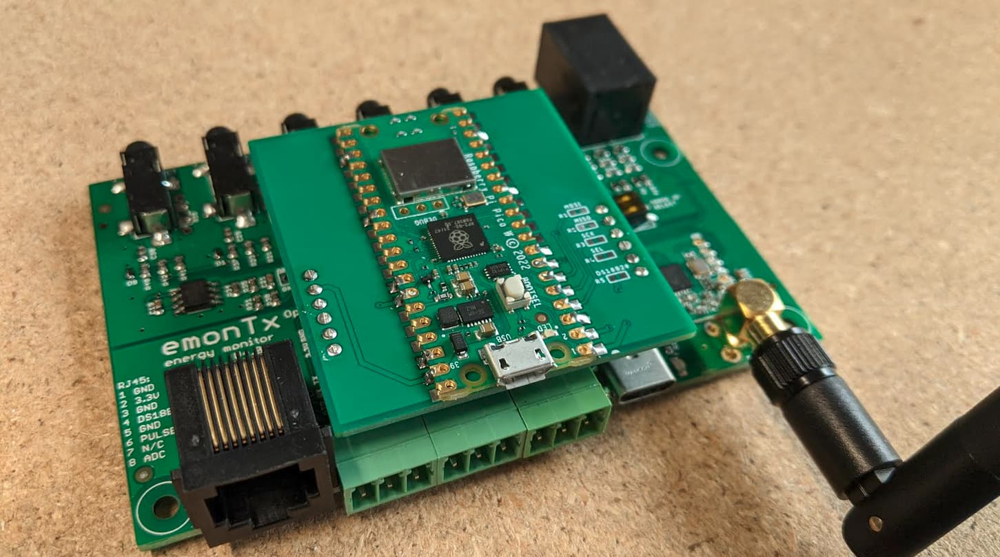
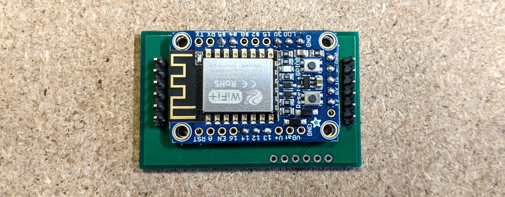
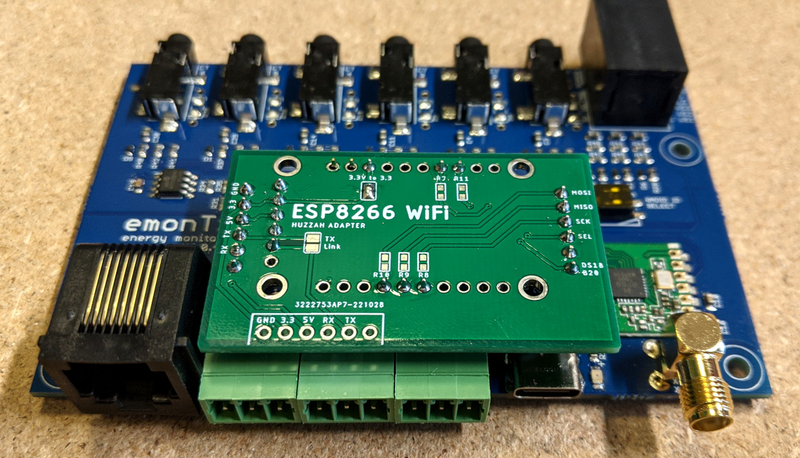
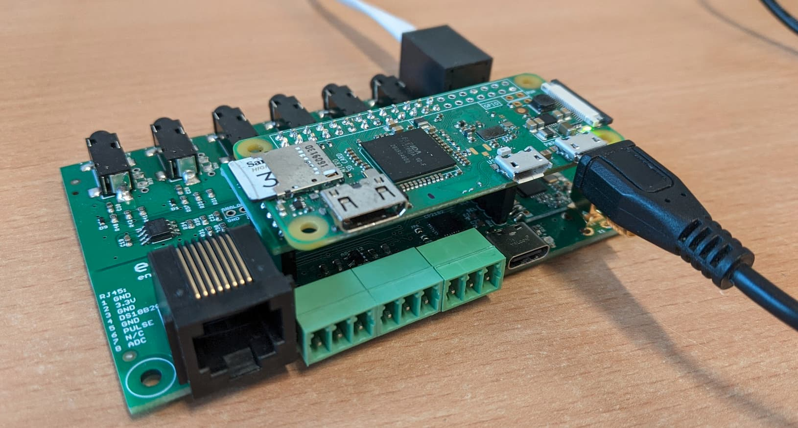

# Expansion boards

The emonTx4 has been designed to make it possible to expand its capability through expansion boards. These mostly focus around adding Wi-Fi communications but there's also a CT channel expansion board for more channels.

---

## Pi Pico WiFi Expansion Board

The Raspberry Pi Pico W is a wireless-enabled version of the original Pi Pico based on the RP2040 chip. This simple expansion board just maps the Pi Pico W pins to the UART and SPI headers on the emonTx4.



### Software Examples

**Arduino**

- [Basic emoncms client](https://github.com/openenergymonitor/emontx4/blob/main/expansion_boards/PiPico/examples/arduino/basic_emoncms_client/basic_emoncms_client.ino)
- [Emoncms client with encryption](https://github.com/openenergymonitor/emontx4/blob/main/expansion_boards/PiPico/examples/arduino/emoncms_client_with_encryption/emoncms_client_with_encryption.ino)
- [Serial config example](https://github.com/openenergymonitor/emontx4/blob/main/expansion_boards/PiPico/examples/arduino/serial_config_struct/serial_config_struct.ino)
- **[Emoncms client with encryption & serial config](https://github.com/openenergymonitor/emontx4/blob/main/expansion_boards/PiPico/examples/arduino/emoncms_client_encryption_serialconfig/emoncms_client_encryption_serialconfig.ino)**

**MicroPython**

- [Basic emoncms client](https://github.com/openenergymonitor/emontx4/tree/main/expansion_boards/PiPico/examples/micropython)

### Uploading Arduino code

This guide provides a good overview of getting started with the Pi Pico W and Arduino IDE: [https://dronebotworkshop.com/picow-arduino](https://dronebotworkshop.com/picow-arduino)

### Uploading MicroPython

1. Download the latest MicroPython Pi Pico W build from here: [https://micropython.org/download/rp2-pico-w](https://micropython.org/download/rp2-pico-w) and drop it onto the drive created by the Pi Pico when plugged in via USB to your computer.
2. Install Adafruit Ampy, see: [https://pypi.org/project/adafruit-ampy](https://pypi.org/project/adafruit-ampy)
3. Upload the micropython example using ampy, e.g:

```
ampy --port /dev/ttyACM0 put basic_emoncms_client.py main.py
```

---

## Adafruit ESP8266 Huzzah Wi-Fi Expansion Board

A simple adapter board that links the ESP8266 Huzzah Wi-Fi board to the EmonTx4. Can run the full EmonESP firmware which can be used to forward the emonTx4 data to Emoncms via HTTP or MQTT. Other firmware examples include an encrypted client with a serial configuration interface. See below.

When mounted on the emonTx4, the ESP8266 Huzzah module sits inverted so as to fit in the emonTx4 enclosure:





**Note:** The ESP8266 adapter PCB design includes the option to solder additional SMT resistors that enable the ESP8266 to take control of the RFM69 Radio module and temperature sensing on the main emonTx4 board. 

### Software Examples

**Arduino / Platform IO**

- [EmonESP](https://github.com/openenergymonitor/EmonESP) (see the [EmonESP user guide](https://github.com/openenergymonitor/emonesp))
- [Basic emoncms client](https://github.com/openenergymonitor/emontx4/tree/main/expansion_boards/ESP8266/examples/basic_emoncms_client)
- [Emoncms client with encryption](https://github.com/openenergymonitor/emontx4/tree/main/expansion_boards/ESP8266/examples/emoncms_client_with_encryption)
- [Emoncms client with encryption & serial config](https://github.com/openenergymonitor/emontx4/tree/main/expansion_boards/ESP8266/examples/emoncms_client_encryption_serialconfig)


### Schematic and board file

- [Eagle files](https://github.com/openenergymonitor/emontx4/tree/main/expansion_boards/ESP8266/hardware)
- [Schematic image](https://github.com/openenergymonitor/emontx4/blob/main/expansion_boards/ESP8266/hardware/schematic.png)
- [Board image](https://github.com/openenergymonitor/emontx4/blob/main/expansion_boards/ESP8266/hardware/board.png)

---

## ESP32 Wi-Fi Expansion Board


### Software Examples

**Arduino / Platform IO**

- [Basic emoncms client](https://github.com/openenergymonitor/emontx4/tree/main/expansion_boards/ESP32/examples/basic_emoncms_client)
- [Emoncms client with encryption](https://github.com/openenergymonitor/emontx4/tree/main/expansion_boards/ESP32/examples/emoncms_client_with_encryption)
- [Emoncms client with encryption & serial config](https://github.com/openenergymonitor/emontx4/tree/main/expansion_boards/ESP32/examples/emoncms_client_encryption_serialconfig)
- [Emoncms client with encryption & serial config & display](https://github.com/openenergymonitor/emontx4/tree/main/expansion_boards/ESP32/examples/emoncms_client_encryption_serialconfig_display)
- [RFM69 SPI test](https://github.com/openenergymonitor/emontx4/tree/main/expansion_boards/ESP32/examples/rfm69cw_test)

---

## Pi Zero Expansion Board



Starting with an SD card running emonSD:<br>
[https://github.com/openenergymonitor/emonpi/wiki/emonSD-pre-built-SD-card-Download-&-Change-Log](https://github.com/openenergymonitor/emonpi/wiki/emonSD-pre-built-SD-card-Download-&-Change-Log)

Configure EmonHub to use the EmonHubOEMInterfacer:<br>
[https://github.com/openenergymonitor/emonhub/tree/master/conf/interfacer_examples/OEM](https://github.com/openenergymonitor/emonhub/tree/master/conf/interfacer_examples/OEM)

    [[OEM]]
        Type = EmonHubOEMInterfacer
        [[[init_settings]]]
            com_port = /dev/ttyAMA0
            com_baud = 115200
        [[[runtimesettings]]]
            pubchannels = ToEmonCMS,
            
---

## 6 CT Expansion Board

See dedicated page: [6 CT Expansion board](6ct_expansion_board.md)


