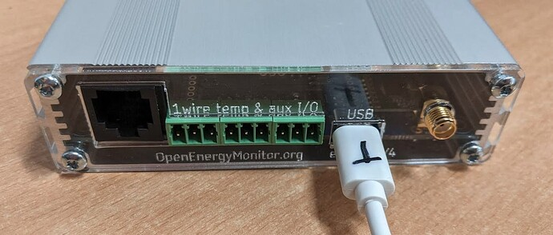
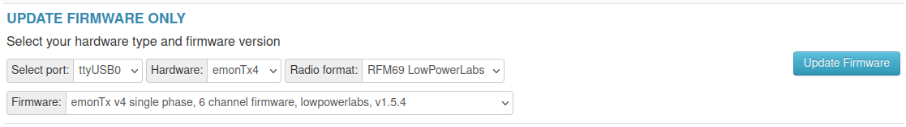
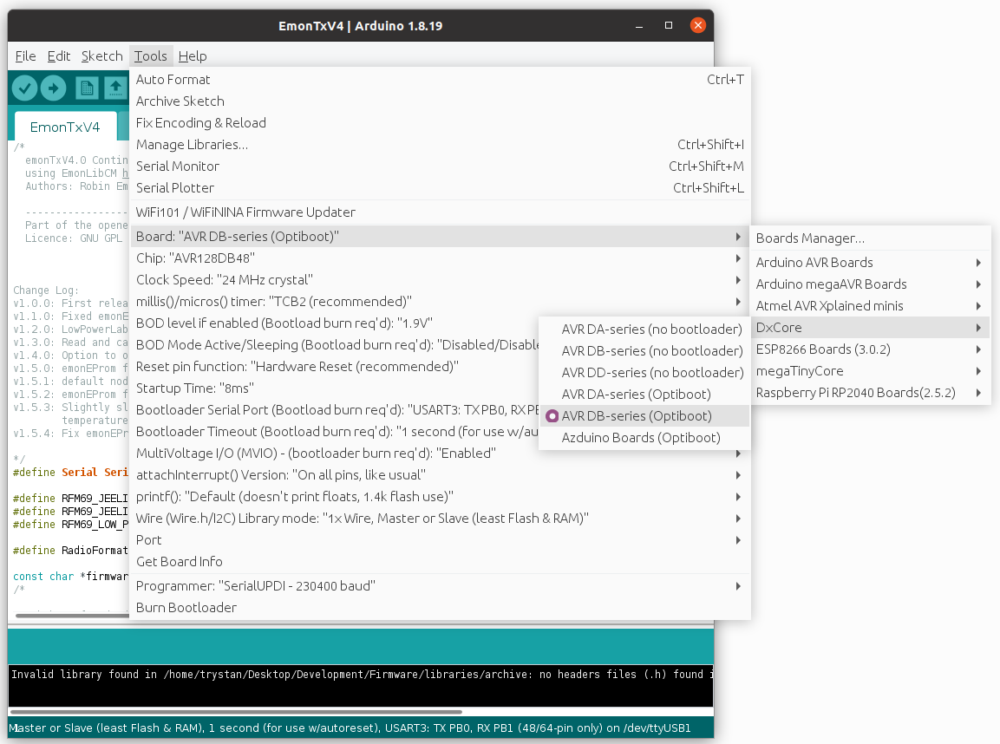
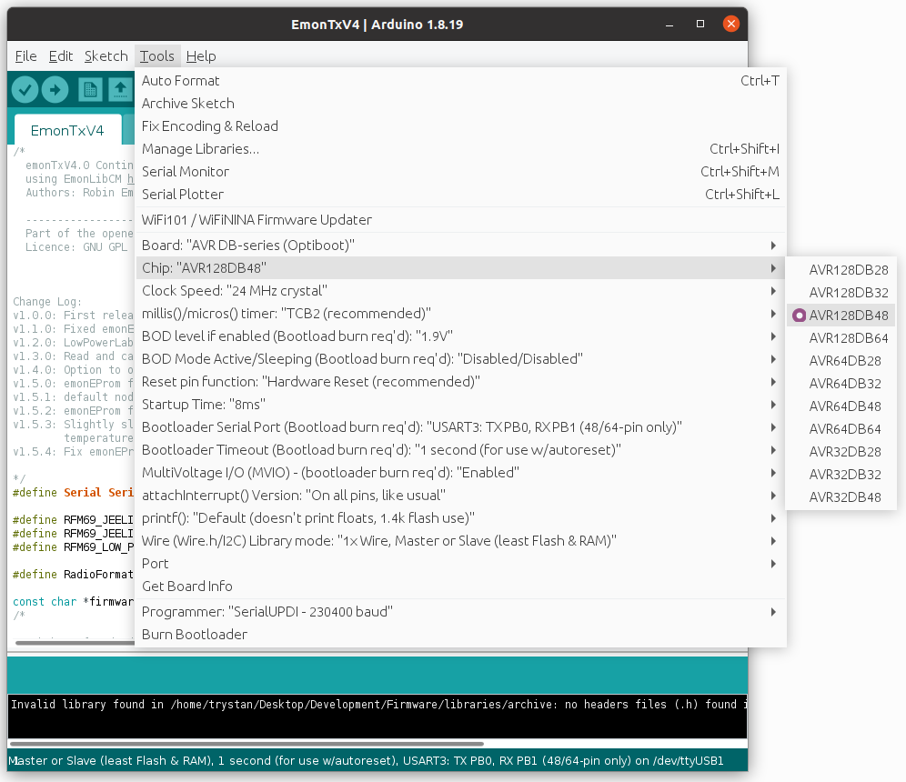
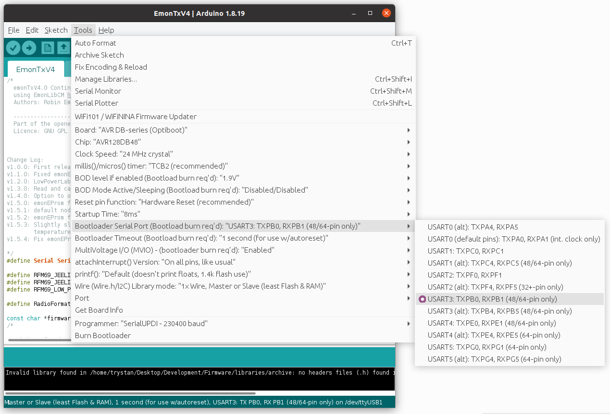

# Firmware

**Updated: 14th May 2024**<br>
There are currently 3 pre-compiled firmware options available via both the Emoncms firmware upload tool and the command line emonupload.py firmware tool:

---

**emonTx4_DB_6CT_1phase_LPL**<br>
Use this firmware for single phase electricity monitoring with up to 6 CT sensors. Pulse sensing is configured on the emonTx4 analog input port which can be configured using a solder bridge. Radio data is transmitted to a receiving emonPi/emonBase via RFM69CW radio. Voltage & CT sensor calibration, pulse sensor configuration and radio settings can be applied via serial configuration.

Note: This firmware **does not support temperature sensing**, please use the `emonTx4_CM_6CT_temperature_LPL` firmware if you wish to use temperature sensors.

This firmware uses the emonLibDB library and is compiled from the `emon_DB_6CT` base firmware.

**emonTx4_DB_6CT_3phase_LPL**:<br>
Use this firmware for three phase electricity monitoring with up to 6 CT sensors. Pulse sensing is configured on the emonTx4 analog input port which can be configured using a solder bridge. Radio data is transmitted to a receiving emonPi/emonBase via RFM69CW radio. Voltage & CT sensor calibration, pulse sensor configuration and radio settings can be applied via serial configuration.

The phase allocation for each CT is as follows:

- CT1: phase 1
- CT2: phase 2
- CT3: phase 3
- CT4: phase 1
- CT5: phase 2
- CT6: phase 3

Note: This firmware **does not support temperature sensing**, temperature sensing is only available via the single-phase `emonTx4_CM_6CT_temperature_LPL` firmware.

This firmware uses the emonLibDB library and is compiled from the `emon_DB_6CT` base firmware with the `#define NUM_V_CHANNELS 3`.

**emonTx4_CM_6CT_temperature**<br>
Use this firmware for single phase applications that either require temperature sensing or/and installations without an emonVs voltage sensor. This firmware uses the older emonLibCM electricity monitoring library that provides temperature sensing support and a fallback option to an assumed RMS voltage value if no AC voltage signal is detected. The value of this `assumedVrms` can be set via serial configuration. This firmware is compiled from the `emon_CM_6CT_temperature` base firmware. 

*Note: Temperature sensing support is achieved with a very slight degradation in electricity monitoring performance, see forum thread about this [here](https://community.openenergymonitor.org/t/emontx4-ds18b20-temperature-sensing-firmware-release-1-5-7/23496/3).*

*The default maximum number of temperature sensors that can be connected is 3 but this can be increased up to 6 by changing the `#define MAX_TEMPS 3` value at the top of the firmware when compiling and uploading from source.*

---

These are now built from a set of base firmware's common to all AVR-DB hardware variants (emonTx4, emonTx5 and emonPi2) available in the [avrdb_firmware repository](https://github.com/openenergymonitor/avrdb_firmware/). The base firmware's include further options available when compiling and uploading these firmwares via the Arduino IDE including:

- **emon_DB_12CT:** emonLibDB, single and three phase, 12 channel firmware support for the expansion board.
- **Analog input:** Reading from the analog input can be enabled for all firmware variants via a `#define` compile option.

## Updating firmware using an emonPi/emonBase (recommended)

The easiest way of updating the emonTx4 firmware is to connect it to an emonBase with a USB cable and then use the firmware upload tool available at `Setup > Admin > Update > Firmware`.

```{warning} 

**System update may be required:** If you don not see the latest firmware version as listed above in the firmware list a full system update is required first.
```

**Note: Upload via USB-C will only work if connected in the right orientation. Try turning the USB-C connector around if upload fails.** Some USB-C connectors have a smooth side on one side and jagged connection of the metal fold on the other. On the cables we have here, the smooth side should be facing up towards the top/front face of the emonTx4:




Refresh the update page after connecting the USB cable. You should now see port `ttyUSB0` appear in the 'Select port` list.



Double check the serial port, this is likely to be 'ttyUSB0' when plugged in via USB device connected. Select 'emonTx4' from hardware.

The standard radio format is 'LowPowerLabs', if you wish to use the emonTx4 with an existing system running JeeLib classic radio format you can select the JeeLib classic radio format here.

## Upload pre-compiled using EmonScripts emonupload2 tool 

On the emonPi/emonBase ensure EmonScripts is updated to latest version then run emonupload2 tool 

    /opt/openenergymonitor/EmonScripts/emonupload2.py

Select hardware then firmware version

```
Select hardware:
  1. emonTx5
  2. emonPi2
  3. emonTx4
  4. emonPi
  5. emonTx3
  6. rfm69pi
  7. rfm12pi
  8. emonTH2
  9. JeeLink
Enter number:3

Select firmware:
1. emonTx4_DB_6CT_1phase_LPL               2.1.0      (Standard LowPowerLabs)
2. emonTx4_DB_6CT_3phase_LPL               2.1.0      (Standard LowPowerLabs)
3. emonTx4_CM_6CT_temperature_LPL          1.6.0      (Standard LowPowerLabs)
```

emonupload2 tool can also be run on any other linux computer by cloning the EmonScripts repo then running the emonupload2.py python script. Python3 required 

    git clone https://github.com/openenergymonitor/EmonScripts

## Upload pre-compiled manually using avrdude

Alternatively to upload the same pre-compiled firmware via command line on emonPi / emonBase: 

    avrdude -C/opt/openenergymonitor/EmonScripts/update/avrdude.conf -v -pavr128db48 -carduino -D -P/dev/ttyUSB0 -b115200 -Uflash:w:emonTx4_DB_6CT_1phase_LPL_v2_1_0.ino.hex:i 

Or using different computer, ensure `avrdude.conf` has `avr128db48` entry i.e DxCore see below instructions 

    avrdude -Cavrdude.conf -v -pavr128db48 -carduino -D -P/dev/ttyUSB0 -b115200 -Uflash:w:emonTx4_DB_6CT_1phase_LPL_v2_1_0.ino.hex:i 
    
You will need avrdude installed (tested on version 6.3-2017) and the custom DxCore avrdude.conf. This can be downloaded here: [DxCore avrdude.conf](https://raw.githubusercontent.com/openenergymonitor/EmonScripts/master/update/avrdude.conf).

## How to compile and upload firmware

### Compile and Upload using PlatformIO

Clone the `avrdb_firmware` repo 

    git clone https://github.com/openenergymonitor/avrdb_firmware
    cd avrdb_firmware/emon_DB_6CT
    
Open `emon_DB_6CT.ino` in an editor and change `#define EMONTX5` to `#define EMONTX4`. 

Change any other compile options as required e.g:

- to use JeeLib classic radio format for compatibility with an existing installation change `#define RFM69_LOW_POWER_LABS` to `#define RFM69_JEELIB_CLASSIC`.
- to enable analog read uncomment `#define ENABLE_ANALOG`.
    
Install PlatformIO core then to compile and upload:

    pio run -t upload

On first run PlatformIO will download automatically all the required libraries. You can also use the PlatformIO GUI. 

### Compile and Upload using Arduino IDE 

If you don’t already have the Arduino IDE it can be downloaded from here:<br>
[https://www.arduino.cc/en/software](https://www.arduino.cc/en/software)

Once you have the IDE installed, you then need to install [Spence Konde’s DxCore](https://github.com/SpenceKonde/DxCore). This can be done by first pasting the following board manager URL in Arduino IDE > File > Preferences:

    http://drazzy.com/package_drazzy.com_index.json

Then navigating to: *Tools > Boards > Boards Manager*, Select “DxCore by Spence Konde” and click Install. 


For more information on DxCore installation see: [https://github.com/SpenceKonde/DxCore/blob/master/Installation.md](https://github.com/SpenceKonde/DxCore/blob/master/Installation.md).

**Libraries**

Locate or create your Arduino Sketchbook directory (location found in Arduino preferences). If it doesnt already exist, create a directory called libraries in the Sketchbook directory and install the following libraries:


1\. Download EmonLibCM library (avrdb branch)<br>
[https://github.com/openenergymonitor/EmonLibCM/tree/avrdb](https://github.com/openenergymonitor/EmonLibCM/tree/avrdb)

2\. Download EmonLibDB library (main branch)<br>
[https://github.com/openenergymonitor/emonLibDB](https://github.com/openenergymonitor/emonLibDB)

2\. Download emonEProm library (avrdb branch)<br>
[https://github.com/openenergymonitor/emonEProm/tree/avrdb](https://github.com/openenergymonitor/emonEProm/tree/avrdb)

3\. Download RFM69_LPL library (main branch)<br>
[https://github.com/openenergymonitor/RFM69_LPL](https://github.com/openenergymonitor/RFM69_LPL)

4\. Download RFM69_JeeLib library (avrdb branch)<br>
[https://github.com/openenergymonitor/RFM69_JeeLib/tree/avrdb](https://github.com/openenergymonitor/RFM69_JeeLib/tree/avrdb)

5\. Download DxCore SpenceKonde OneWire library:<br>
[https://github.com/SpenceKonde/OneWire](https://github.com/SpenceKonde/OneWire)


**Open and edit the AVR-DB firmware**

Clone the `avrdb_firmware` repo 

    git clone https://github.com/openenergymonitor/avrdb_firmware

Open the base firmware that you wish to use in the Arduino IDE e.g `emon_DB_6CT.ino`.

Change `#define EMONTX5` to `#define EMONTX4`. 

Change any other compile options as required e.g:

- to use JeeLib classic radio format for compatibility with an existing installation change `#define RFM69_LOW_POWER_LABS` to `#define RFM69_JEELIB_CLASSIC`.
- to enable analog read uncomment `#define ENABLE_ANALOG`.

**Compilation settings:**

With DxCore and the libraries installed the firmware should then compile. 

Under Tools, select the following configuration options:

- Select Board "AVR DB-series (Optiboot)"
- Select Chip: AVR128DB48
- Clock Speed: 24 MHz Crystal
- Bootloader serial port: UART3: TXPB0, RXPB1

Select Board "AVR DB-series (Optiboot)"



Select Chip: AVR128DB48



Bootloader serial port: UART3: TXPB0, RXPB1



