# EmonTx4 Heatpump Monitor

This guide covers how to setup an emonTx4 as a heat pump monitor, measuring:

- Heat pump electrical consumption
- Immersion heater & backup heater consumption
- Flow temperature
- Return temperature
- Other temperatures e.g: DHW & outside
- Flow rate and heat output via an analog reading from a Sika VFS flow meter (supplied with many heat pumps, e.g: Mitsubushi EcoDan, Samsung & Daikin).


This can be used to create the full 'My Heatpump' emoncms dashboard, showing electric, heat, COP and system temperatures.

It's a configuration that is particularly well suited as a retrofit heat pump monitoring system that can be added on to a heat pump that is already installed, the CT sensors can be clipped on existing cables without rewiring, temperature sensors can be attached and an existing Sika flow meter interfaced with, without requiring draining down of the system and installation of a heat meter. 

This said, if you have the opportunity to install an inline class 1 electricity meter and class 2 heat meter, which requires electrical installation and system drain down, we would recommend that approach for higher accuracy, see our [emonHP system for more details](https://shop.openenergymonitor.com/level-3-heat-pump-monitoring-bundle-emonhp/).

## Hardware

The following outlines the kit we would recommend for an emonTx4 heat pump monitor installation. You may want to add more CT sensors or temperature sensors depending on your installation requirements.

- 1x emonTx4
- 1x emonVs-psu voltage sensor and power supply<br>*or the emonVs-mini together with a seperate power supply.*
- 1x+ CT sensors (rating and number as required)
- 2x+ DS18B20 temperature sensors<br>*firmware supports 3x by default, additional sensors can be added.*
- 1x+ Cable to read from Sika VFS analog output with integrated voltage divider.


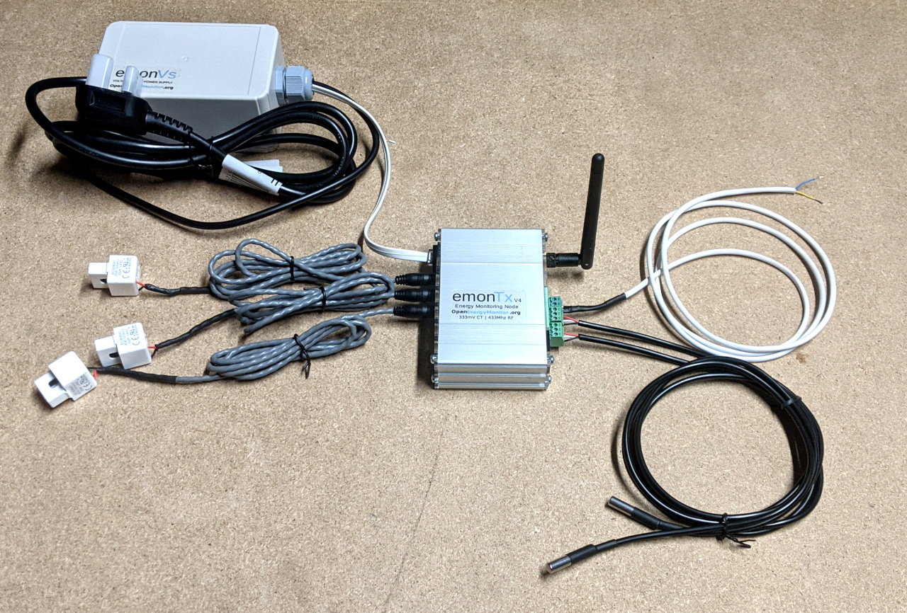

## 1. Electricity monitoring

There are a number of different components that make up the electricity consumption of a heat pump, these can include:

1. Heat pump compressor and air source fan.
2. Control electronics often located alongside the compressor (usually in the outside unit of a monoblock air source heat pump).
3. Inside controllers
4. Central heating pumps
5. Zone or diverter valves
6. Immersion heater for legionella and DHW backup.
7. Backup direct electric heater
8. Fan assisted radiators
9. Other 3rd party controls
10. Monitoring 

**Mitsubishi Ecodan** heat pumps usually have 1,2,3,4 & 5 on one supply and circuit breaker, 6 & 7 will usually be connected seperately. 

On several EcoDan installations that we have worked with the outside unit was connected via an armoured cable to the main consumer unit - often some distance away. The primary pipework and a signal & power cable then run to a location inside the house where the inside controller is located alongside other components such as the central heating pump, diverter valve, hot water cylinder etc.

We often find that the most convenient place for the CT sensor that measures the electricity consumption of the EcoDan outside unit (and usually inside controller) is inside the outside unit itself, with a cable extension back to an emonTx4 located next to the inside controller. 

The following picture shows a 50A CT sensor on the main supply connection terminals inside the outside unit. This unit is a 11kW (heat output) unit which specifies a 32A MCB rating. The maximum current seen so far on this unit has been 17A.

```{warning}
The supply to the heat pump should be disconnected before opening the front panel on the outside unit. This work should only be carried out by a suitably competent person due to electrocution risk.
```

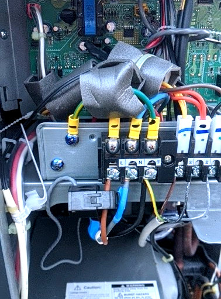

It's then often convenient to add additional CT sensors at the location of the inside controller to measure central heating pump electricity consumption and the immersion heater separately.

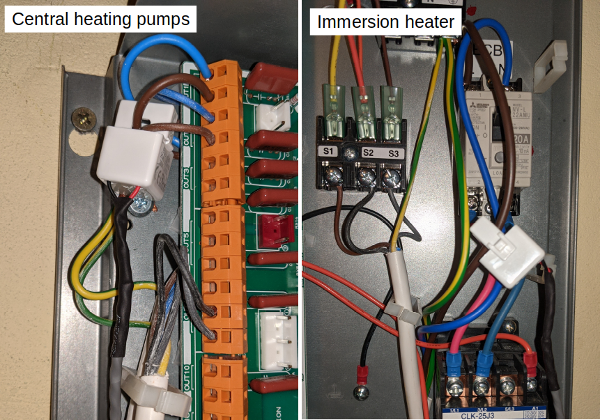

The CT sensors connect to the CT sensor inputs on the emonTx4. 

**Voltage sensing**<br>
For accurate electricity monitoring we would always recommend a voltage sensor. Without a voltage sensor the standby electricity consumption of a heat pump can read as high as ~270W when the real (active) power reading should actually be 12W! The EcoDan heat pumps that we have tested this on so far have all exhibited very low power factor, leading to these large differences between real (active) power and apparent power. The power factor is usually better when the heat pump is running with a difference of 10-20% between real power and apparent power.

The emonTx4 can either use the full emonVs-psu (voltage sensor and power supply) or the cheaper emonVs-mini (voltage sensor only). If using the emonVs-mini, a separate USB power supply is required. The installation picture above shows an installation with the full emonVs-psu.

## 2. Temperature sensing

The next step is to add temperature sensors. It can be useful to measure a wide range of system and environment temperatures when monitoring heat pumps. 

In the following example installation we are monitoring the flow and return temperatures in the primary pipework. Together with a flow rate measurement, we can use these to calculate the heat output of the heat pump.

We are also measuring the flow and return temperatures on the radiator side of the low loss header. These can be used to check how well balanced the flow rates in and out of the low loss header are and how much distortion is present.

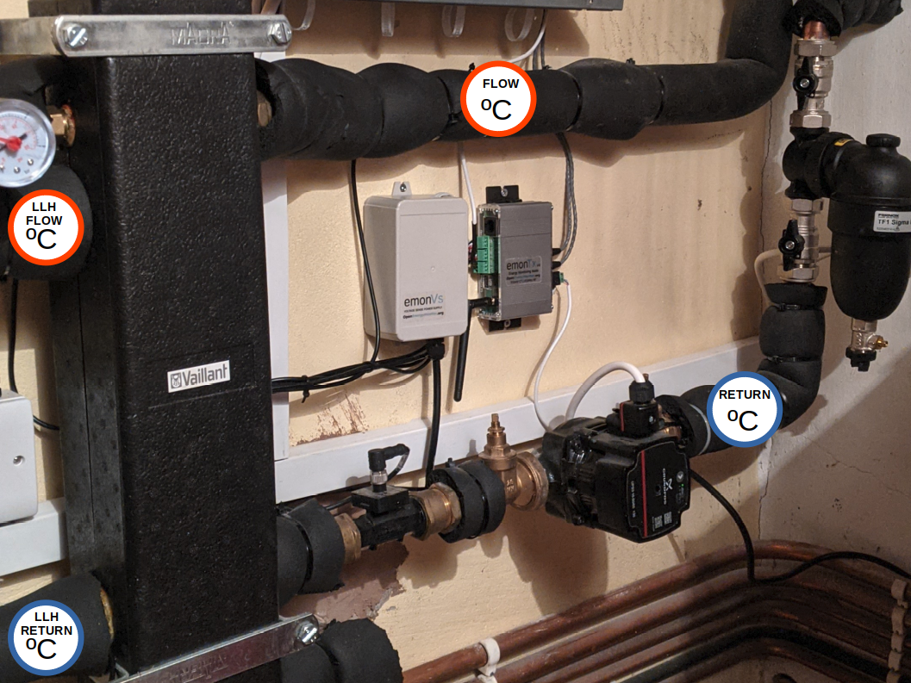

It can also be worthwhile measuring:

- Outside temperature: can be used together with flow temperature to estimate Carnot COP)
- DHW tank temperature: useful for analysing DHW cycle timing and hot water use.
- Room temperatures: useful for analysing fabric efficiency or effectiveness of heat pump in providing comfort.

### Temperature sensor installation

The emonTx4 single phase *emonTx4_CM_6CT_temperature* firmware supports temperature sensing using DS18B20 temperature sensors. We supply these as encapsulated waterproof sensors in our shop. One of the challenges to accurate temperature measurement is mounting these to the flow and return primary pipework. John Cantor of [heatpumps.co.uk](https://heatpumps.co.uk), who we have worked with on heat pump monitoring, wrote a useful blog post with suggestions for different ways to mount these sensors here [Temperature sensing with OpenEnergyMonitor](https://heatpumps.co.uk/2015/06/08/temperature-sensing-with-openenergymonitor/).

The most accurate mounting method would be to use temperature sensor pockets which immerse the sensor in the fluid being measured. These however require a system drain down and plumbing work to install. 

When retrofitting monitoring to an existing system it's often more practical to mount the sensors to the outside of the pipework. The following illustrates one way of doing this, we are still experimenting with the best approach.

Testing the difference between sensor pockets and pipe surface measurement suggests that pockets read about 0.5C higher than measurements taken at the pipe surface. See temperature sensing error below.

1\. Remove the rubber heat shrink cover from the bottom end of the DS18B20 temperature sensor, this ensures that the sensor cylinder is in maximum contact with the pipe.

2\. Choose a straight piece of pipe where you can ensure a good insulation cover after installing the sensor, avoid attaching to fittings. Clean the copper pipe with some wire wool to remove any oxide layer.

3\. Place a little thermal paste (used for computer CPU heat sinks) on the pipe to aid conduction.

4\. In this example we have wound a length of solid core copper wire around the pipe and sensor with the idea that it will aid conduction of heat more evenly around the sensor body. A cable tie on the cable end of the sensor can help keep the sensor in place.

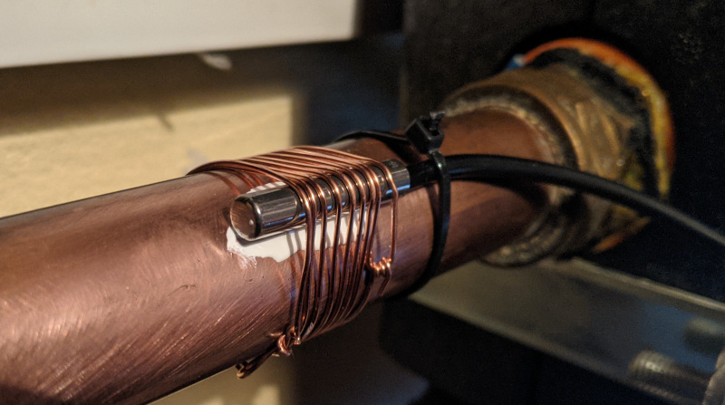

<!--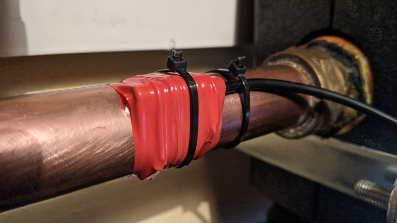-->

5\. Ensure that the sensor and pipework is well insulated.

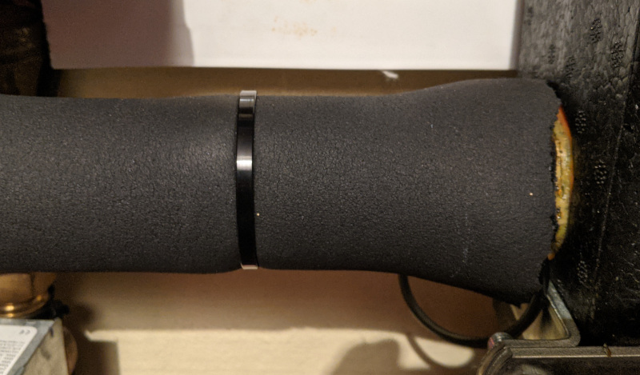

6\. Connect temperature sensors to the emonTx


7\. Ensure that the emonTx4 solder bridges are configured for temperature sensing on the first two terminal blocks and analog on the last block:

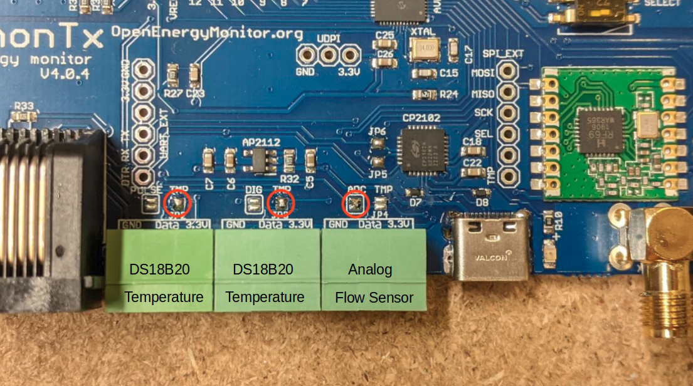

### Temperature sensing error

A small error in temperature measurement can make a large difference to heat output measurement accuracy. To give an example, let's say we have a relative error between the flow and return temperature measurement of 0.2°C. If the flow rate is 20 L/min, the heat error is: 

    4200 J/kg.K x (20 L/min / 60 s/min) x 0.2 K = 280W

The DS18B20 temperature sensors that the emonTx4 supports have a maximum error of ±0.5°C from -10°C to +85°C. The typical error curve suggests a mean error of -0.2°C at 20°C decreasing to 0°C at 60°C. The default resolution set in the firmware is 11-bit which provides a resolution of 0.125°C.

For heat measurement the relative error between the flow and return temperature sensors is more important than the absolute error of the individual flow and return temperature measurements. 

```{image} img/heatpump/temperature_rel_error_test.jpg
:class: bg-primary
:width: 300px
:align: right
```

One relatively simple way to test this relative error is to attach the sensors to be installed together and take comparative measurements immersed in warm water. To give an example of the kind of difference we've observed, a test over 138 readings gave an average difference of 0.03°C between two sensors from the same batch and a 0.1°C comparing with a sensor from a different batch. The accuracy of the heat measurement could be improved by calibrating for these differences.

In our experience ecapsulated DS18B20 temperature sensors mounted to the surface of copper pipe as shown above can read ~0.5°C lower than sensors immersed in water using sensor pockets. The flow and return temperature sensors usually read lower by the same amount, which means the deltaT and heat measurement is not necessarily affected. Taking account of this difference and applying a manual adjustment may however be worthwhile when using the flow temperature sensor for carnot COP calculation.

```
T_condensing = T_flow + 4K
T_refrigerant = T_ambient - 6K
Carnot_COP = (T_condensing + 273) / ((T_condensing+273) – (T_evaporating + 273))
Practical_COP = 0.5 x  Carnot_COP (a real-life heat pump achieves about 50% its 'ideal' efficiency)
```

If the flow temperature measurement is measured as 30°C at the surface of the pipe rather than 30.5°C via a pocket and the outside temperature is 5°C. The difference in COP would be a predicted COP of 4.386 rather than 4.331, an error of around 1.3%. The difference in predicted heat output at 500W electrical input would be ~28W.

## 3. Reading from a Sika VFS analog output

Some heat pumps have a Sika VFS flow sensor installed as part of the standard installation package. The Sika VFS flow sensor looks like this:


If you have a Mitsubushi EcoDan, this will usually be installed near your EcoDan controller, which is often mounted close to the hot water tank.

The Sika VFS flow sensor that is usually installed alongside Mitsubushi EcoDan heat pumps has an output of 0.5V at 5L/min and 3.5V at 100L/min. The following lists typical flow rates and Sika VFS output voltages that we might see from a range of heat pump sizes:

- 5kW heat output at a dT of 5K is ~14 L/min (0.78V)
- 8kW heat output at a dT of 5K is ~23 L/min (1.07V)
- 11kW heat output at a dT of 5K is ~32 L/min (1.35V)
- 14kW heat output at a dT of 5K is ~40 L/min (1.61V)

We can see that at 23, 32 & 40 L/min the output voltage is higher than the 0-1.024V range of the analog input on the emonTx4. We therefore need to scale this voltage down to better fit the emonTx4 input voltage range. This can be done with a simple voltage divider.

In the example pictured below I have choosen a voltage divider with equal values for both top and bottom resistors, 100k each. This halves the voltage seen at the emonTx4 analog input pin. 1.61V will now become 0.8V and the maximum measurable flow rate is just over 50L/min.

Different voltage divider values can be choosen to best fit the range of flow rates expected.

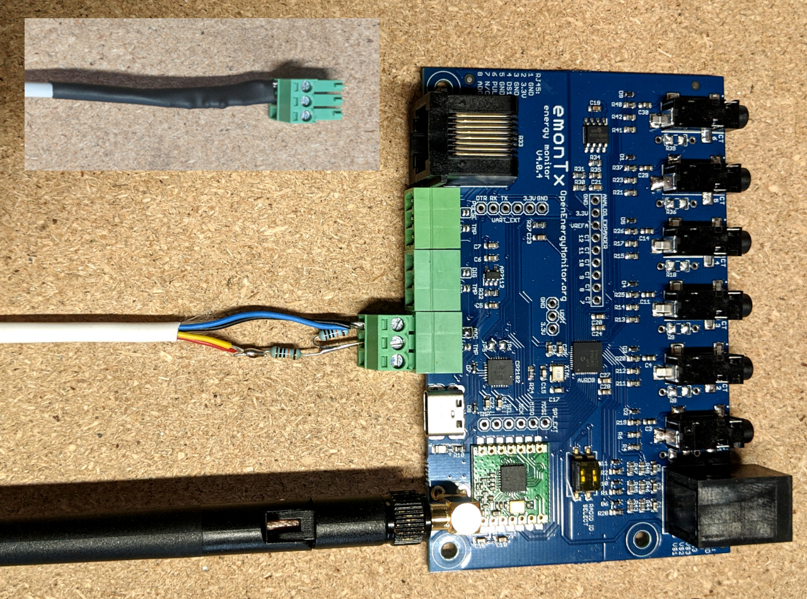 

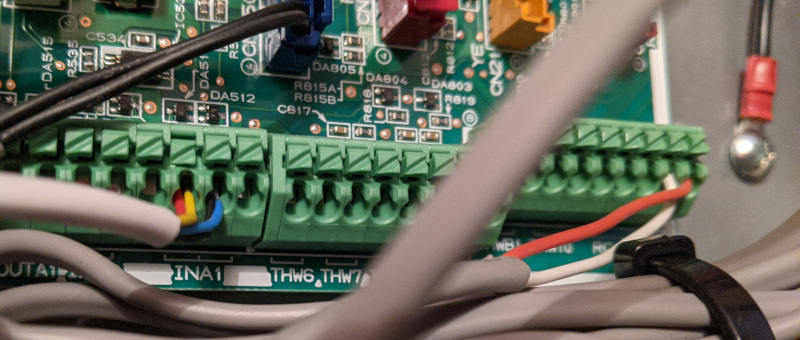

## 4. Firmware

Open the base firmware `emon_CM_6CT_temperature` from the [avrdb_firmware](https://github.com/openenergymonitor/avrdb_firmware) firmware repository.

1\. Make sure to select emonTx4 as the hardware variant:

```
// 1. Set hardware variant
// Options: EMONTX4, EMONTX5, EMONPI2
#define EMONTX4
```

2\. Uncomment the line `#define ENABLE_ANALOG`:

```
// 6. Enable analog reading (disabled by default)
// IF ENABLED CHANGE NUM_I_CHANNELS = 5
// #define ENABLE_ANALOG
```

3\. Set `NUM_I_CHANNELS = 5`. We need to use one of the CT sensor ADC channel input allocations for the analog input instead:

```
// 4. Set number of current channels
#define NUM_I_CHANNELS 5
```

4\. Increase the number of temperature sensors if required (the first image above shows an example with 4x temperature sensors: primary flow and return and secondary flow and return after the low loss header). E.g increase the default MAX_TEMPS 3 to 4 if required:

```
// 8. The maximum number of temperature sensors that can be read
#define MAX_TEMPS 4
```

5\. Compile and upload the firmware to the emonTx4. 

## 5. Basestation or Wi-Fi adapter

The emonTx4 can transmit its data via: 

1. 433 MHz radio to a receiving emonBase basestation or emonPi.
2. USB cable direct connection to an emonBase/emonPi
3. Direct WiFi using an expansion board.

See guides:

- [Install Guide](emontx4_emonbase_install.md)
- [Adding to an existing install](emontx4_emonpi_install.md)
- [Expansion boards](expansion_boards.md)


If transmitting via 433 MHz radio, the following emonhub.conf node decoder is required to decode the radio packet data:

```
[[17]]
  nodename = emon_CM_6CT_temperature_17
  [[[rx]]]
    names = MSG, Vrms, P1, P2, P3, P4, P5, E1, E2, E3, E4, E5, T1, T2, T3, T4, pulse, analog
    datacodes = L,h,h,h,h,h,h,l,l,l,l,l,h,h,h,L,h
    scales = 1,0.01,1,1,1,1,1,1,1,1,0.01,0.01,0.01,1,1
    units = n,V,W,W,W,W,W,Wh,Wh,Wh,Wh,Wh,C,C,C,p,
```

## 6. Emoncms input configuration

The following set of screenshots gives an example of configuring this analog input for use in reading the flow rate from the Sika VFS flow sensor. The flow rate is then used together with measurement of flow and return temperature to calculate heat.

These screenshots are from the emonPi2 guide, the process is however exactly the same for the emonTx4:

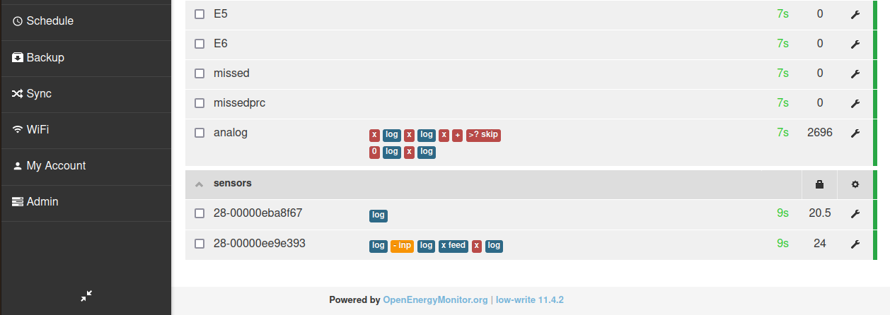

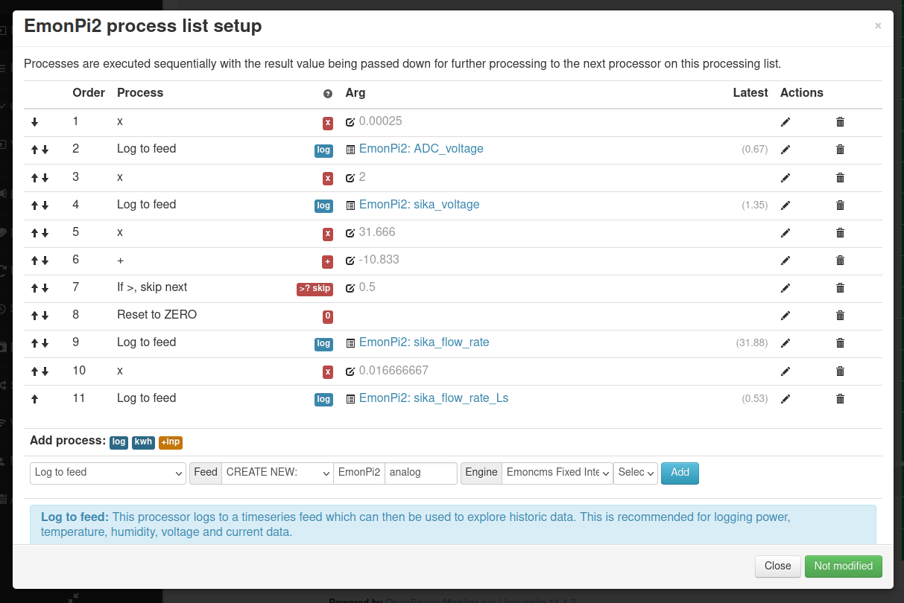

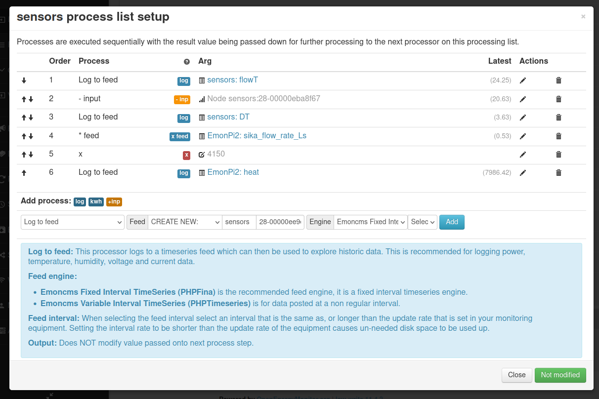

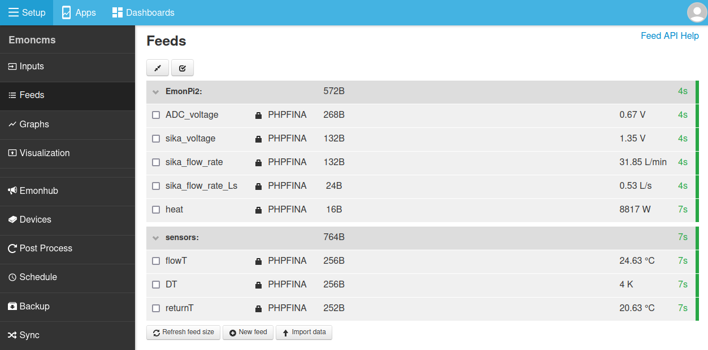

## 7. Emoncms & MyHeatpump app

Emoncms includes an application specific heat pump dashboard available in the Apps module. The following video gives a good overview of what this dashboard can do, how to access daily electricity consumption and heat output data as well as detailed system temperature and power data.

There's also a little feature shown briefly at the end that simulates the heat output and COP of the heat pump based on the Carnot COP equation.

<div class='videoWrapper'>
<iframe width="560" height="315" src="https://www.youtube.com/embed/jBY1Sx3LR2o" frameborder="0" allowfullscreen></iframe>
</div>

It's also worth checking out David Bowen (@MyForest) heat pump app, see community forum post: [Heat Pump Experimentation App - Release News](https://community.openenergymonitor.org/t/heat-pump-experimentation-app-release-news/13423).

