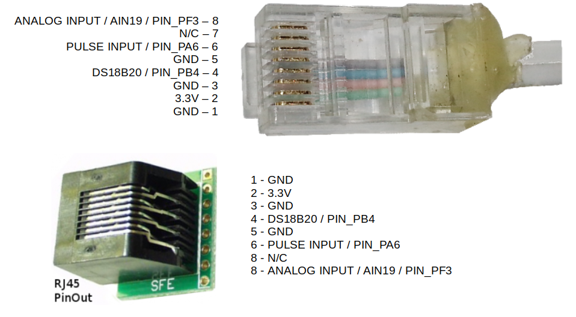

# Other sensors

## Temperature sensing

The emonTx4 supports temperature sensing via [DS18B20 temperature sensors](../electricity-monitoring/temperature/DS18B20-temperature-sensing.md) when using the single phase emonLibCM *emonTx4_CM_6CT_temperature* firmware. 

These are small temperature sensors with a 12-bit ADC and a digital output all in the sensor itself. Communication is over a one-wire bus and requires little in the way of additional components. The sensors have a quoted accuracy of ±0.5°C in the range -10°C to +85°C.

It is possible to connect DS18B20 temperature sensors to the emonTx4 either via the 3 pluggable terminal blocks or via the RJ45 connector (just to the left of the terminal blocks in the picture below, see pinout at the bottom of this page).

Pluggable terminal block connections are: GND (black), DATA (white), 3.3V (red), left to right, repeated for each of the three blocks:


The function of the emonTx4 terminal blocks can be changed with small solder-jumpers just above the terminals on the emonTx4 PCB. The default configuration is 3x temperature sensor inputs, one on each terminal block. Notice the bridged solder jumpers circled in red and labeled 'TMP' in the picture below: 


The DS18B20 input is connected to digital PIN_PB4 on the AVR128DB48 microcontroller.

```{tip}
It's possible to change the function of the 'Data' pin on each of the terminal blocks. 

- Terminal 1 (left) can be either temperature sensing or pulse input. 
- Terminal 2 (middle) can be either temperature sensing or digital input/output PA7. 
- Terminal 3 (right) can be either temperature sensing or analog input AIN19 (CT12).

Move the solder link as required to configure these for your application. Additional firmware changes are required to make use of the digital input/output PA7 and the analog input AIN19 (CT12).
```

The *emonTx4_CM_6CT_temperature* firmware supports up to 3x temperature sensors by default. This can be extended to support up to 6x temperature sensors by changing the firmware setting `MAX_TEMPS` at the top of the firmware file *(see base firmware `emon_CM_6CT_temperature` from the [avrdb_firmware](https://github.com/openenergymonitor/avrdb_firmware) repository)*:

```
// 8. The maximum number of temperature sensors that can be read
#define MAX_TEMPS 3
```

**Note:** Due to the way that the one wire protocol works, specifically its requirement for precise timing requiring brief periods of disabling other interrupts on the microcontroller, there is a minor negative impact on electricity monitoring performance when adding temperature sensors. An introduction of ~0.04% error with 3 temperature sensors or 0.07% error with 6 temperature sensors, out of a maximum component tolerance error of 1.2%. Please see the detailed forum post on this here: [EmonTx4 DS18B20 Temperature sensing & firmware release 1.5.7](https://community.openenergymonitor.org/t/emontx4-ds18b20-temperature-sensing-firmware-release-1-5-7/23496).

Temperature sensing is unfortunately not supported when using the more recent emonLibDB electricity monitoring library and associated firmwares: *emonTx_DB_6CT_1phase*, *emonTx_DB_6CT_3phase* and *emon_DB_12CT*. There is more going on in this electricity monitoring library in order to support 3-phase measurement and it was not possible to integrate temperature sensing in the same way. Please use the earlier single phase emonLibCM based firmware *emonTx4_CM_6CT_temperature* if you do require temperature sensing at the emonTx4 measurement point. 

For applications that require temperature sensing and 3phase emonTx4 monitoring or up to the 12 CT sensors, we recommend using a seperate USB powered emonTH2 with multiple external temperature sensors to achieve this.

## Pulse counting

- The pulse counting input on the emonTx4 is available as standard on the RJ45 socket (see pinout below). 

- The same pulse input can be configured for use on the first pluggable terminal block (closest to the RJ45 socket) as seen in the picture below with a solder bridge on solder jumper marked 'PULSE'. Solder bridge marked 'TMP' must also be removed.

- The pinout of the terminal block is: GND, PULSE INPUT, 3.3V.

- The pulse input is connected to PIN_PA6 on the AVR128DB48 microcontroller.

- With custom firmware modification and correctly configured solder bridges, further pulse inputs could be added to the other terminal block inputs as well. The middle pin of the second terminal block can be connected to PIN_PA7, the middle pin of the third terminal block is connected to PIN_PF3 (alternatively analog input 19).


## Analog input

It's possible to link analog input AIN19 (CT12) to right-most terminal block as shown below, the analog input is also available via the RJ45 socket (see pinout below). An example application is measuring flow rate using a Sika VFS which has an analog voltage output.


```{warning}
The analog input voltage must be in the range **0 - 1.024V**. This ADC is configured for this range in order to suit the 333mV CT sensors. This analog input can not be used when using the emonTx4 with the C.T Extender board.
```

**How to use the analog input:**

Using the analog input requires compiling and uploading custom configuration of the emonTx4 firmware. Start by setting up the Arduino IDE environment following the [firmware guide](firmware.md).

For applications that require an analog input and temperature sensing open the base firmware `emon_CM_6CT_temperature` from the [avrdb_firmware](https://github.com/openenergymonitor/avrdb_firmware) firmware repository.

1\. Make sure to select emonTx4 as the hardware variant:

```
// 1. Set hardware variant
// Options: EMONTX4, EMONTX5, EMONPI2
#define EMONTX4
```

2\. Uncomment the line `#define ENABLE_ANALOG`:

```
// 6. Enable analog reading (disabled by default)
// IF ENABLED CHANGE NUM_I_CHANNELS = 5
// #define ENABLE_ANALOG
```

3\. Set `NUM_I_CHANNELS = 5`. We need to use one of the CT sensor ADC channel input allocations for the analog input instead:

```
// 4. Set number of current channels
#define NUM_I_CHANNELS 5
```

4\. Compile and upload the firmware to the emonTx4. 

## RJ45 Pinout

[](img/emonTx4_RJ45_pinout.png)
