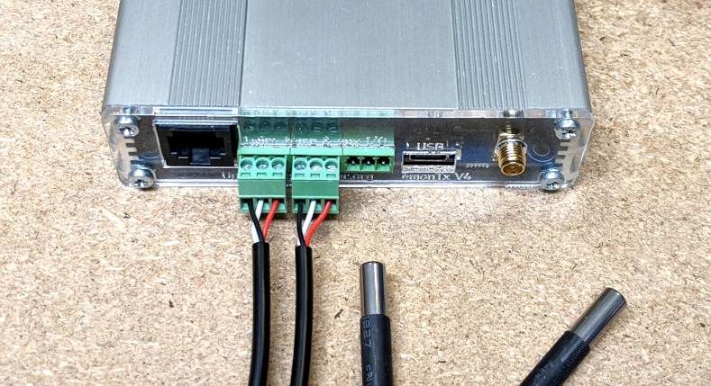
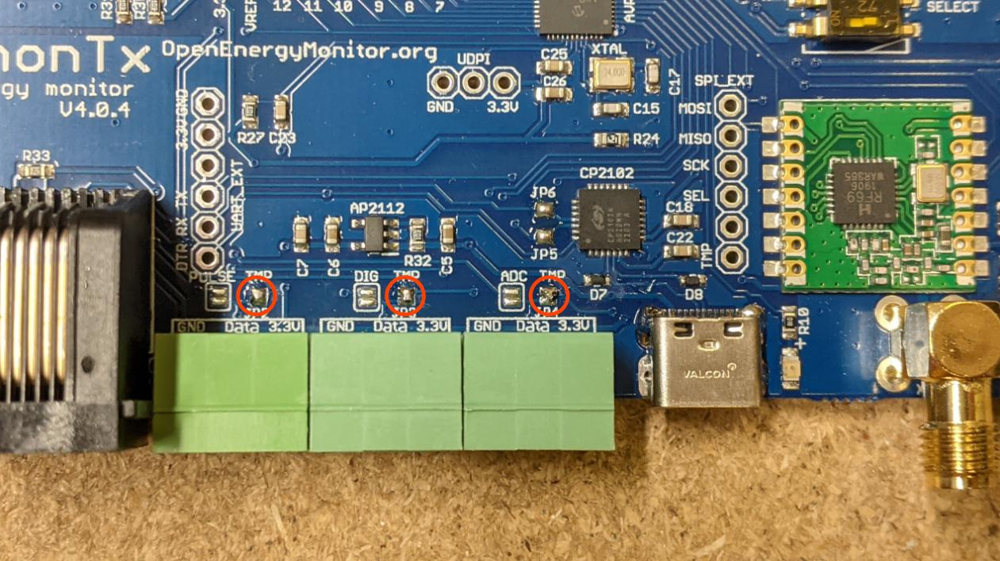
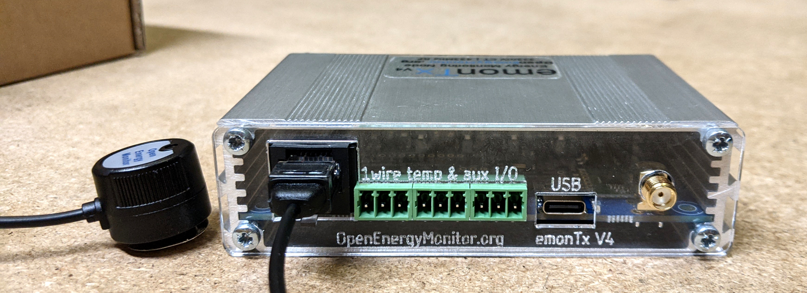
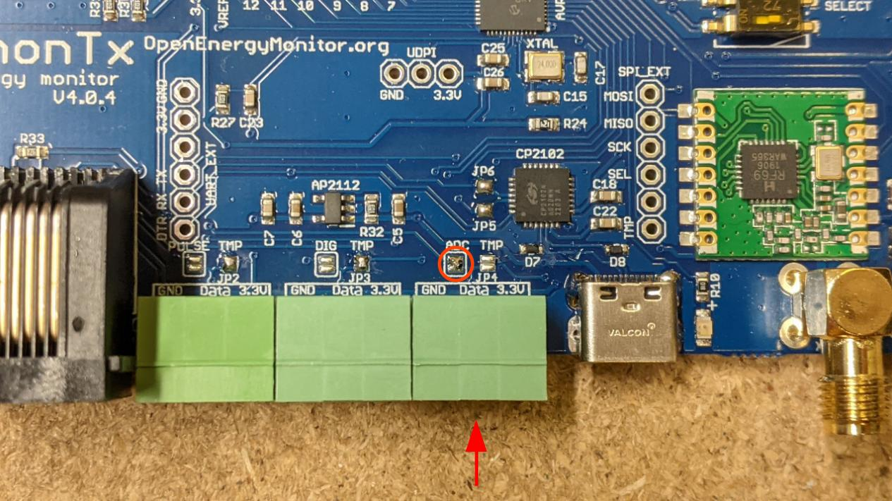

# Other sensors

## Temperature sensing

The emonTx4 supports temperature sensing via [DS18B20 temperature sensors](../electricity-monitoring/temperature/DS18B20-temperature-sensing.md). These are small temperature sensors with a 12-bit ADC and a digital output all in the sensor itself. Communication is over a one-wire bus and requires little in the way of additional components. The sensors have a quoted accuracy of ±0.5°C in the range -10°C to +85°C.

It is possible to connect DS18B20 temperature sensors to the emonTx4 either via the 3 pluggable terminal blocks or via the RJ45 connector (just to the left of the terminal blocks in the picture below).

Pluggable terminal block connections are: GND (black), DATA (white), 3.3V (red), left to right, repeated for each of the three blocks:



The function of the emonTx4 terminal blocks can be changed with small solder-jumpers just above the terminals on the emonTx4 PCB. The default configuration is 3x temperature sensor inputs, one on each terminal block. Notice the bridged solder jumpers circled in red and labeled 'TMP' in the picture below: 



The DS18B20 input is connected to digital PIN_PB4 on the AVR128DB48 microcontroller.

```{tip}
It's possible to change the function of the 'Data' pin on each of the terminal blocks. 

- Terminal 1 (left) can be either temperature sensing or pulse input. 
- Terminal 2 (middle) can be either temperature sensing or digital input/output PA7. 
- Terminal 3 (right) can be either temperature sensing or analog input AIN19 (CT12).

Move the solder link as required to configure these for your application. Additional firmware changes are required to make use of the digital input/output PA7 and the analog input AIN19 (CT12).
```

The emonTx4 firmware supports up to 3x temperature sensors by default. This can be extended to support more temperature sensors with firmware modification. *However it is worth noting that due to the way that the one wire protocol works, specifically it's requirement for precise timing requiring brief periods of disabling other interrupts on the microcontroller, that there is a minor negative impact on energy monitoring performance as you add more temperature sensors. This can manifest as a ±1-4W error on some CT channels. This effect can be mitigated to some extent by reducing the electricity monitoring sample rate.*

## Pulse counting



## Analog input

It's possible to link analog input AIN19 (CT12) to right-most terminal block as shown below. An example application is measuring flow rate using a Sika VFS which has an analog voltage output.



```{warning}
The analog input voltage must be in the range **0 - 1.024V**. This ADC is configured for this range in order to suit the 333mV CT sensors. 
```

**How to use the analog input:**

**1\.** Using the analog input requires compiling and uploading custom code to the emonTx4. Start by setting up the Arduino IDE environment following the [firmware guide](firmware.md).

**2\.** Note the first step of installing the arduino libraries 'Download EmonLibCM library (avrdb branch)', you will need the `channel_mean` branch of this library. Select and download this branch from github or if you have used git command line, run: `git checkout channel_mean` to switch to this branch.

**3\.** Open the standard EmonTx4 firmware and save as a new copy e.g EmonTx4\_analog\_input. The simplest way of incorporting an analog input alongside everything else that this firmware does is to repurpose the configuration of one of the CT channels for our analog reading. We will repurpose channel CT6 in this example, assuming that we dont need all 6 CT channels.

**4\.** Find the line:

    EmonLibCM_SetADC_IChannel(9, EEProm.i6Cal, EEProm.i6Lead);
    
replace with ADC input 19:

    EmonLibCM_SetADC_IChannel(19, EEProm.i6Cal, EEProm.i6Lead);
    
**5\.** Find the line:

    emontx.P6 = EmonLibCM_getRealPower(5); 
    
replace with:

    emontx.P6 = EmonLibCM_getMean(5); 
    
This will output the 10s mean value of ADC input 19 onto the P6 output.

**Optional:** If you are using this input to interface with a Sika VFS flow sensor and are simultaneously taking flow and return temperature measurements as well using the DS18B20 temperature sensing input, it's worthwhile converting the analog input value to a heat output at this point as well.

Append the following just after line `emontx.T3 = allTemps[2];`:

```{code}

// Sika VFS analog to flow rate conversion
float sika_m = 31.666;                    // (100.0-5.0 L/min) / (3.5-0.5 V);
float sika_c = -10.833;                   // 100.0 - (sika_m*3.5);
float analog_to_voltage = 0.000911765;    // (1.024/4096)/(68k/(180k+68.0k)); voltage divider calibration
float heat_cal = 4150.0/60.0;             // divide by 60 converts L/min to L/s

float flow_rate = sika_m*(emontx.P6 * analog_to_voltage) + sika_c;
if (flow_rate<0.5) flow_rate = 0.0;       // if less than 0.5 L/min disable
float dT = (emontx.T2 - emontx.T1)*0.01;  // Assumes T2 = flow temp and T1 = return temp
float heat = heat_cal*flow_rate*dT; 

emontx.P6 = heat;                         // set P6 to heat here instead of the raw analog value
```

`emontx.T2` here is the flow temperature and `emontx.T1` is the return temperature measured using DS18B20 temperature sensors.

The analog_to_voltage calibration includes the voltage divider factor. In this example we have a voltage divider with R<sub>bottom</sub> = 68k and R<sub>top</sub> = 180k, which is scaling down the voltage output of the sika so that 3.5V on the sika is reduced to 0.96V on the analog input pin. These need to be placed externally to the emonTx4 - they are not included on the board.
