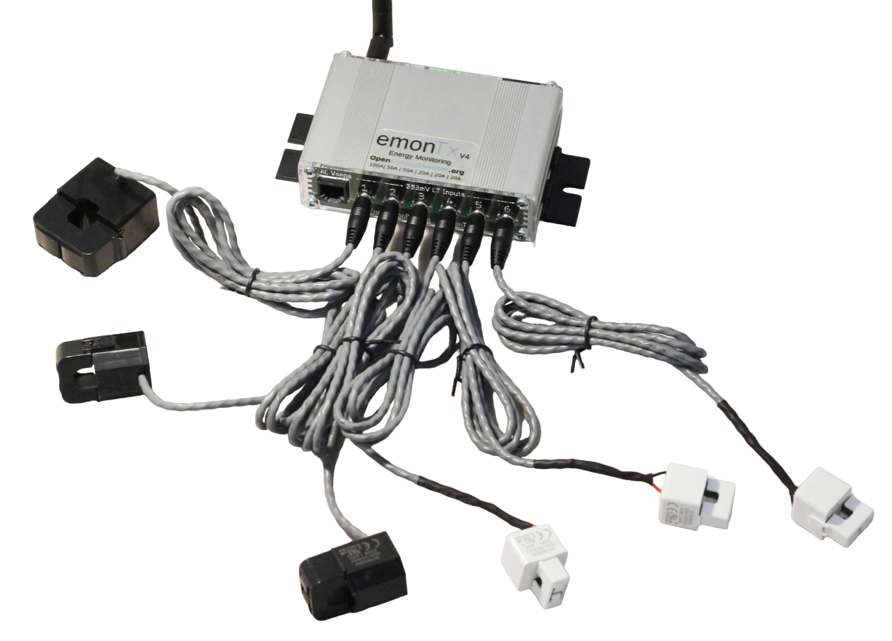

<a class="btn" href="https://shop.openenergymonitor.com/single-phase-6-channel-energy-monitoring-emontx-v4/">Buy in Shop</a>

# Overview

The emonTx v4 is the latest generation of OpenEnergyMonitor open source monitoring hardware, redesigned with a focus on higher accuracy, more CT channels, precision voltage sensing and a new microcontroller core. When combined with the new emonVS voltage sensor, the emonBase base-station and a selection of CT sensors, it provides an end-to-end electricity monitoring solution perfect for monitoring home consumption, solar generation, EV charging, heat pumps, battery storage or any AC electrical circuit for that matter.

## Key features

- 6x clip-on CT current sensor inputs (suitable for a range of 333mV voltage output CT sensors).
- emonVs precision voltage sensor input.
- Full Real/Active power measurement & continuous sampling.
- Cumulative energy persisted on reboot.
- The initial firmware release supports single phase monitoring only.
- Hardware support for 3 phase voltage sensing (3-phase firmware available 2023).
- 3 pluggable terminal block inputs for DS18B20 temperature sensing, pulse counting or an analogue voltage input.
- RJ45 socket for pulse counting and DS18B20 temperature sensors.
- On-board USB to UART converter for easier programming and serial output.
- 433 MHz radio transceiver
- Extension header pins for use with ESP8266, ESP32, Pi Pico & Pi Zero development board extension modules
- Wall-mount aluminium enclosure

## Technical spec

- Microcontroller: [Microchip AVR128DB48](https://www.microchip.com/en-us/products/microcontrollers-and-microprocessors/8-bit-mcus/avr-mcus/avr-db)
- Arduino core support [DxCore by SpenceKonde](https://github.com/SpenceKonde/DxCore)
- ADC Resolution: 12-bit
- Precision voltage reference: [MCP1502](https://www.microchip.com/en-us/product/MCP1502)
- On board USB to UART converter: CP2102
- RFM69cw 433 MHz radio

## Accuracy

We have taken several key steps to improve accuracy with the emonTx4. The largest source of improvement comes from: a higher accuracy voltage sensor, higher accuracy CT current sensors and a wider range of CT sensors with current ratings that can better suit the load being monitored (making sure the analog-to-digital range of the microcontroller is being put to full use).

The key sensor and component tolerances are now:

- CT Sensors: ±0.5%
- EmonVs voltage sensor: ±0.5%
- Analog voltage reference ±0.2%
- Combined: ±1.2%

We have also upgraded the microcontroller from the ATmega328 to and AVR128DB48. The main improvement is a higher resolution ADC at 12-bits (4x the resolution of the ATmega328) alongside the capability to monitor more channels.
