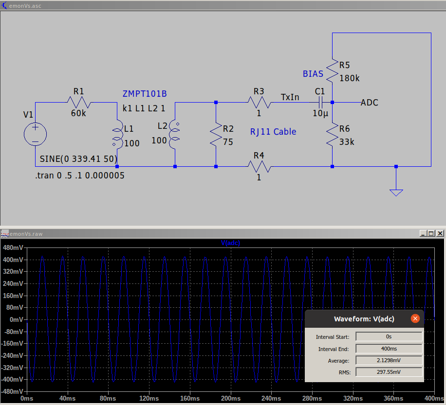
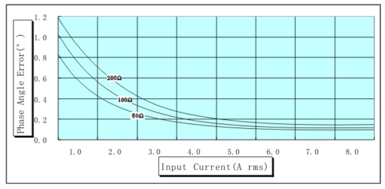

# Technical Guide

## RFM69 Radio

The emonTx4 includes a 433 MHz RFM69CW radio on the board. This can be used to transmit data to an emonPi or emonBase base station. These radios provide a neat and simple way of sending data between devices.

The emonTx4 supports 3 different RFM69 radio formats:

1. LowPowerLabs (Default & Recommended)
2. JeeLib Classic (backwards compatibility mode)
3. JeeLib Native

There is a shop option to select between Standard (LowPowerLabs) and Backwards compatibility (JeeLib Classic) when ordering an emonTx4.


Pre-compiled hex files are available for all three of these, see: [https://github.com/openenergymonitor/emontx4/tree/main/firmware/EmonTxV4/compiled](https://github.com/openenergymonitor/emontx4/tree/main/firmware/EmonTxV4/compiled).

The format can also be chosen when compiling the firmware, see: [https://github.com/openenergymonitor/emontx4/blob/main/firmware/EmonTxV4/EmonTxV4.ino#L31](https://github.com/openenergymonitor/emontx4/blob/main/firmware/EmonTxV4/EmonTxV4.ino#L31)

```
#define RFM69_JEELIB_CLASSIC 1
#define RFM69_JEELIB_NATIVE 2
#define RFM69_LOW_POWER_LABS 3

#define RadioFormat RFM69_LOW_POWER_LABS
```

The LowPowerLabs and JeeLib Native formats both support encryption. Please see encryption section below for details on how to secure this.

### Background on libraries and formats

We have used the RFM69 radio now for quite a few years but the release of the emonTx4 brings with it an important change in the software implementation used for the radio. Up until this point we had been using the **JeeLib 'Classic' packet format.** This was built around compatibility with an earlier generation radio module called RFM12. The benefit of backwards compatibility however meant that some of the new features implemented on the RFM69 module could not be used. These included the FIFO data buffers which reduce the requirement to interrupt the main microcontroller (useful for energy monitoring) and hardware encryption. 

Jean Claude Wippler who originally developed the JeeLib library did develop a version of the library that made use of the new RFM69 features. He called the resulting packet format the **'Native' packet format**. There's a useful post on the differences [here](https://jeelabs.org/book/1522a/index.html). More recently Robert Wall adapted this JeeLib native library for use with the emonPi, to make continuous sampling possible.

The **LowPowerLabs packet format and library** is a separately developed project by [Felix Rusu of LowPowerLabs](https://github.com/LowPowerLab/RFM69). In terms of packet format and implementation it is in many ways similar to the JeeLib Native packet format library - in that it uses the native RFM69 module features. The radio settings such as bit rate are subtly different (55,555 bits/s vs 49,230 bits/s). The header section of the radio packet payload is also slightly differently enabling 1023 possible nodes, 256 possible networks and a control byte used for requesting acknowledgments.

**The emonTx4 uses the LowPowerLabs radio format by default.**<br>
The release of the emonTx4 was originally going to include the switch from the JeeLib Classic format to the JeeLib Native format, but in the end we've decided to make the switch to the LowPowerLabs library instead. 

This significant change was made primarily in order to make use of the packet acknowledgment and retry feature implemented in the LowPowerLabs library, which in testing was critical to bring packet loss down to the magic 0% level (with nodes within good signal range).

The second important benefit of this change is to have a radio format that is compatible with the wider actively developed LowPowerLabs RFM69 ecosystem. 

**Uncoordinated vs coordinated transmit**<br>
The present implementation can still be improved further, OpenEnergyMonitor nodes are still transmitting radio data in an uncoordinated way, which increases the likelihood of packet collisions and therefore packet loss. Nodes do listen briefly for a quiet radio window and the emonTx4 requests a packet acknowledgment, retrying if not heard, but there is a limitation to how many nodes that can practically be accommodated using this scheme alone.

The next step in development is to explore the option to either have the base station request data from each radio node in sequence or for the base station to broadcast some kind of timing coordination packet, say every 10s. Nodes would then offset the time at which they transmit by some delay relating to their unique node id's.

### Encryption

Encryption is enabled by default when using the LowPowerLabs or JeeLib Native packet formats.

**It is not however secure as the encryption key used is publicly available.** There is not yet a mechanism in place to generate and distribute the encryption key's to radio nodes in an automated way, or as part of an initial pairing process.

The default encryption key is currently hard coded in the firmware, e.g on line 230 of the emonTx4 firmware:

```
rf.encrypt("89txbe4p8aik5kt3");
```

In order to truly secure the radio network you can create your own secret 16 character encryption key. This encryption key needs to be copied to all radio nodes on the network, including the base-station.

The emonBase available for purchase with the emonTx4 in the OpenEnergyMonitor shop comes with an SPI RFM69 receiver board. The encryption key used for this is currently hard-coded in emonHub on line 51: [https://github.com/openenergymonitor/emonhub/blob/master/src/interfacers/EmonHubRFM69LPLInterfacer.py#L51](https://github.com/openenergymonitor/emonhub/blob/master/src/interfacers/EmonHubRFM69LPLInterfacer.py#L51).

This key needs to be modified here to match the secret key used on the emonTx4. The result will be a secure, encrypted radio network.

## Voltage sensing

The following LTSpice schematic & simulation describes the emonTx4 voltage sensing circuit.



*Download [voltage sensor LTSpice simulation](files/emonVs.zip)*

1. On the left, the mains supply is connected through a series of 10k, 0.1%, 250mW current limiting resistors. These add up to a total resistance of 60k. The primary winding of the ZMPT101B precision voltage transformer also has a series resistance of 120 Ohms. This means we would expect the current in the primary to be 3.992 mA at a mains voltage of 240V RMS.

2. The ZMPT101B precision voltage transformer itself has a 1:1 relationship between primary and secondary current. While the suggested current is 2mA on the datasheet the transformer is rated up to 10ma and the phase error is significantly less at 4mA than 2ma. 

3. Next we convert the secondary current to a voltage using the burden resistor (R2, 75R, 0.1%, xxxmW). The burden resistor alone would give a voltage output of 299.4mV RMS when the mains voltage is 240V.

4. The actual output voltage is a little less due to the impedance of the bias circuit. We can treat R5 (180k) and R6 (33k) as being in parallel with the burden resistor R2. The effective resistance is then: 1/((1/75)+(1/33000)+(1/180000)) = 74.799 Ohms. This gives an output voltage of 298.6 mV.

5. The output voltage as simulated by LTSpice taking into account the indicated inductance values of the voltage sensing transformer, small effect of the RJ11 cable resistance and capacitor C1 is a little lower at 297.55 mV.

6. The above suggests a calibration value of 240 / 0.29755 = 806.58

7. If we use this calibration value in the emonTx4 firmware and compare the resulting RMS voltage with parallel measurement from SDM120 electric meters we usually see the SDM120 voltage measurement reading about 0.3% higher. This suggests a calibration value of:<br>`806.58 × 1.003 = 809.0`.

8. If we compare with a non-isolated version of the circuit above (omitting the ZMPT101B) consisting of a voltage divider with R1 (top) = 60k and R2 (bottom) = 75 Ohms. The RMS voltage difference is ~0.2%. This suggests that the voltage calibration for a single emonTx4 should be:<br>`806.58 × 1.002 = 808.2`.

9. The difference between the LTSpice simulated voltage output derived calibration and calibration based on comparison to an SDM120 or the non-isolated voltage sensor test is likely due to three main factors:

    - Transformer coupling factor
    - Error in the inductance value used in the simulation
    - Higher coil impedance due to higher coil temperature @ 4ma.
  
Work is ongoing to improve these parameters used in the LTSpice simulation.

**Phase angle error**

An important factor with both voltage and current sensing is phase error. The following chart from the ZMPT101B datasheet shows the phase error at different input currents. 

We have chosen current limiting resistors on the primary to give an input current of ~4mA at 240V RMS and 2mA at 120V RMS in order to reduce both the extent of the phase error and the variation - the curve is flatter between 2mA and 4mA than it is between 1mA and 2mA.

This does of course have a small penalty in terms of increased power consumption. Increasing from 0.5W at 2mA to 1W at 4mA.




