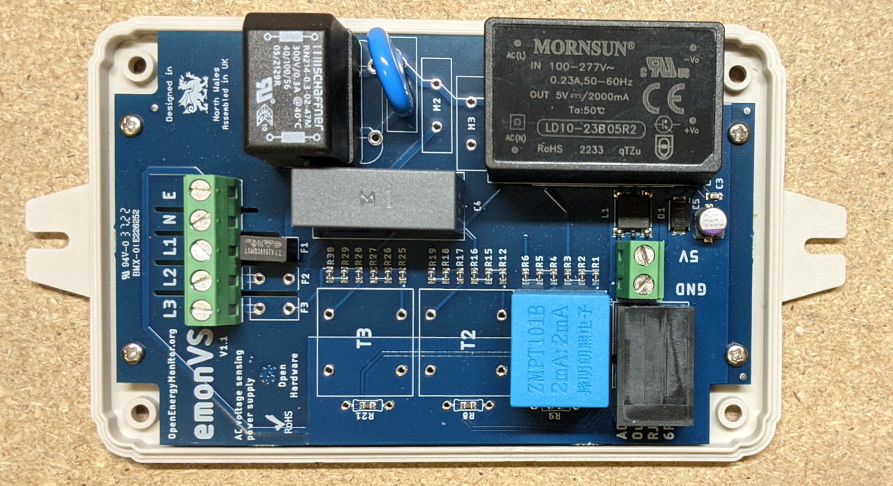
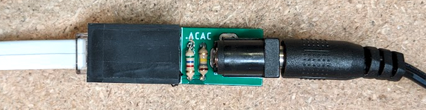

# Voltage sensors

## Overview

There are 3 different voltage sensor options that are compatible with the emonTx4. While the **standard voltage sensor available in the bundle is the emonVs-PSU** (voltage sensor and power supply) you may want to select a different voltage sensor depending on your installation and requirements.

**The emonTx4 firmware currently only supports single-phase operation, 3-phase firmware will be available in 2023. It is possible to order the 3-phase version of the emonVs-PSU unit which will then be compatible with the 3-phase firmware once it is available.**

Here is a quick overview of the 3 options:

## emonVs-PSU

A combined precision 1-3 phase **voltage sensor and power supply** unit. When bought as a single-phase variant is comes with a cable and plug for use with a standard AC socket outlet but it can alternatively be installed by a suitably competent person into a 6A or lower circuit protection device in the fuse board (consumer unit) or a 3A fused spur (Note: The supplied emonVs mains power cable has a cross sectional area of 1.5mm^2). This can provide a tidy installation if no socket is available and helps ensure higher monitoring uptime if sockets are at risk of being unplugged for use by other appliances.

The following picture shows what is inside the box for the single phase configuration. The 3-phase variant includes 3x ZMPT101B precision voltage transformers (T1, T2 & T3), 3x fuses (F1, F2 & F3) and 3x MOV surge protectors (M1, M2 & M3). One of each for each phase.

- Supports a range of mains voltages 120-240V, US, EU, UK.
- Output AC voltage signal on RJ11 @ 120V = (120V / 60k 0.1%) x 75R 0.1% = 150 mV
- Output AC voltage signal on RJ11 @ 240V = (120V / 60k 0.1%) x 75R 0.1% = 300 mV
- Precision current-type voltage transformer: ZMPT101B (0.2%) 
- Combined tolerance of voltage sensor components: 0.4%
- 10W Mornsun power supply can power both the emonTx v4 (via RJ11) and the emonBase (via USB-C)
- 1A Fuse, MOV surge protector, Common mode choke & filter capacitor.
- Wall mountable.

## emonVs-mini

A simple single-phase precision **voltage sensor only** (no integrated power supply). The emonTx4 will require a separate power supply/source when used with this voltage sensor. Supplied with a mains cable and plug for use with a standard AC socket outlet.

This can be a good solution if you have sockets near by and a spare USB power supply that can be used to power the emonTx4. An existing emonPi or emonBase could also be used to power and read data from the emonTx4 over USB.

- Supports a range of mains voltages 120-240V, US, EU, UK.
- Output AC voltage signal on RJ11 @ 120V = (120V / 60k 0.1%) x 75R 0.1% = 150 mV
- Output AC voltage signal on RJ11 @ 240V = (120V / 60k 0.1%) x 75R 0.1% = 300 mV
- Precision current-type voltage transformer: ZMPT101B (0.2%)
- Combined tolerance of voltage sensor components: 0.4%
- 1A Fuse & MOV surge protector
- Wall mountable.

## ACAC Converter

If you already have an ACAC adapter voltage sensor spare from one of our earlier units e.g emonTx2, emonTx3 or emonPi. This small adapter can be used to convert the voltage and connector to the ~300mV RJ11 input on the emonTx4. The tolerance of the ACAC adapters are ±3% and voltage divider resistors will be ±1% (not pictured), the accuracy of using an ACAC adapter can be improved with careful calibration, more details to follow.

Available as a development board in the shop soon.

