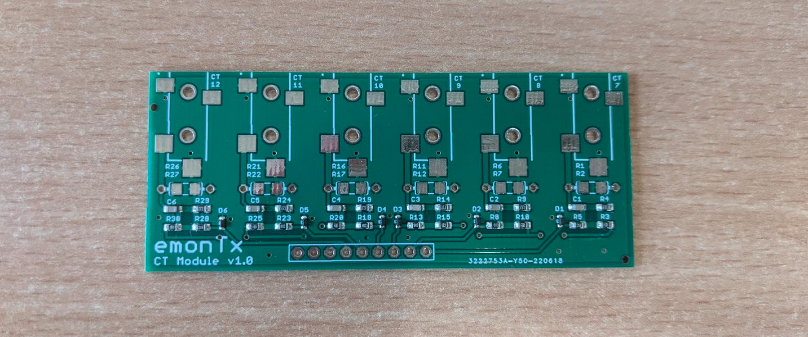

# EmonTx v4 CT Expansion Board

The expansion board adds another 6 CT inputs, bringing the total to 12. This utilises the larger amount of analog inputs on the 48pin AVR-DB chip.

While the first version of the hardware for this is available, the firmware for this functionality is not yet available.

