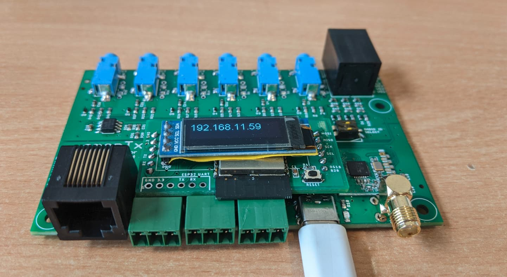

# EmonTx v4 ESP32 Extension Board

### Software examples:

- [Basic emoncms client](https://github.com/openenergymonitor/emontx4/tree/main/extensions/ESP32/examples/basic_emoncms_client)
- [RFM69cw test](https://github.com/openenergymonitor/emontx4/tree/main/extensions/ESP32/examples/rfm69cw_test)
