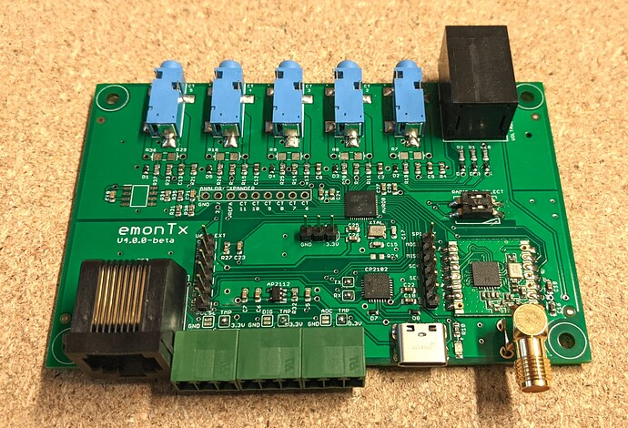

# EmonTx v4

The emonTx v4 is an energy monitoring transmitter unit that can monitor up to 6 AC circuits using CT sensors and the OpenEnergyMonitor 1-3 phase voltage sensing unit. At it's core is a Microchip AVR128DB48 microcontroller - responsible for sampling the current and voltage waveforms and calculating the power and energy values. These are then either transmitted to a emonPi or emonBase base-station via the 433MHz radio link or sent directly to a remote EmonCMS server using an optional ESP32 WiFi adapter. The emonTx v4 also supports temperature sensing and pulse counting.



**Key features**

* Micro-controller: AVR128DB48 (VQFN 128 kb flash, 48-pin package)
* 3 voltage channels (via RJ11 connector top-right, interfaces with separate voltage sensing board)
* 6 CT current channels on the base board.
* Option to extend the number of CT channels to 12 via an additional extender board.
* Precision voltage reference for the ADC to improve accuracy.
* RJ45 socket for pulse counter and DS18B20 temperature sensing.
* 3x 3-WAY pluggable terminal blocks for selectable temperature sensing, pulse or additional analog input.
* RFM69CW 433MHz radio transceiver
* DIP Switch to select node id
* USB-C power and integrated CP2102 usb to serial chip
* Serial and SPI pin headers designed for ESP8266+I2C LCD based shield module (more details soon).

The dimensions of this board are slightly smaller than that of the emonTx v3 at 65mm long rather than 80mm this provides a proportional saving on the cost and material requirements for the aluminium enclosure, which goes part of the way to offset the additional cost of some of the additional components on the board.

The board is designed to support both single and full 3-phase electricity monitoring when used in conjunction with the relevant external voltage sensing board. And the CT extender pin headers should provide a cost effective way of gaining additional CT channels.

The on-board USB to serial chip will make it easier and neater to have a hard-wired installation linking the emonTx to a RaspberryPi based base station.

## Schematic and board file images:


### Community & Support

- [OpenEnergyMonitor Forums](https://community.openenergymonitor.org)

OpenEnergyMonitor Shop Support: support@openenergymonitor.zendesk.com

### License

- The hardware designs (schematics and CAD files) are licensed under a Creative Commons Attribution-ShareAlike 3.0 Unported License.
- The firmware is released under the GNU GPL V3 license The documentation is subject to GNU Free Documentation License
- The hardware designs follow the terms of the OSHW (Open-source hardware) Statement of Principles 1.0.

### Disclaimer

```
OUR PRODUCTS AND ASSEMBLY KITS MAY BE USED BY EXPERIENCED, SKILLED USERS, AT THEIR OWN RISK. TO THE FULLEST EXTENT PERMISSIBLE BY THE APPLICABLE LAW, WE HEREBY DISCLAIM ANY AND ALL RESPONSIBILITY, RISK, LIABILITY AND DAMAGES ARISING OUT OF DEATH OR PERSONAL INJURY RESULTING FROM ASSEMBLY OR OPERATION OF OUR PRODUCTS.

Your safety is your own responsibility, including proper use of equipment and safety gear, and determining whether you have adequate skill and experience. OpenEnergyMonitor and Megni registered partnership disclaims all responsibility for any resulting damage, injury, or expense. It is your responsibility to make sure that your activities comply with applicable laws, including copyright. Always check the webpage associated with each unit before you get started. There may be important updates or corrections. All use of the instructions, kits, projects and suggestions given both by megni.co.uk, openenergymonitor.org and shop.openenergymonitor.org are to be used at your own risk. The technology (hardware , firmware and software) are constantly changing, documentation (including build guide and instructions) may not be complete or correct.

If you feel uncomfortable with assembling or using any part of the system, return it to us for a full refund.
```

